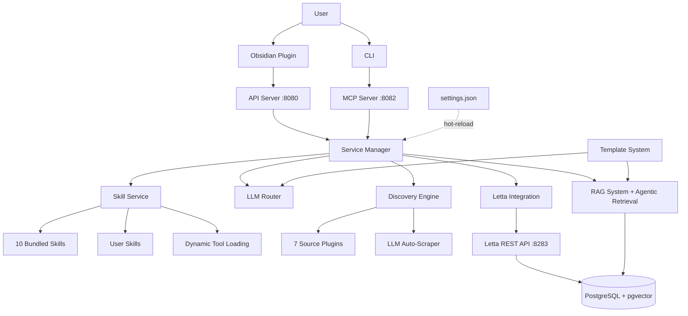

<p align="center">
  
</p>

# Thoth Research Assistant

A local-first, extensible research assistant for staying on top of AI/ML papers. Built with Python, Letta, and Obsidian.

[](https://python.org)
[](LICENSE)

---

## About This Project

### The Problem

As an AI practitioner juggling a full-time job while trying to stay current with rapid advancements in AI research, I found myself drowning in papers. Existing research tools were too rigid—they locked me into their workflow, their sources, their extraction schemas. I couldn't easily add new paper sources, customize what metadata got extracted, or control where my data lived.

But the real friction wasn't just the lack of customization—it was the **interface**. Research tools forced me to constantly hunt through settings files, create countless memory configurations, edit YAML configs, and manage dozens of rule files. Sure, I *could* edit these manually, but why should that be the only option?

### The Insight

Users want a single integration point: natural language. They don't want to manage files—they want to tell the agent what they need and have it happen.

This drove a core architectural decision: **the agent has access to everything a user can do manually**. Every setting, every prompt template, every research query, every extraction schema—the agent can read and modify all of it through MCP tools. The system is deeply configurable, but users shouldn't have to learn the configuration surface to use it.

In practice, this means you can say things like:
- *"The notes you're generating from papers need to include methodology sections"* — the agent updates the analysis schema
- *"My research question about reinforcement learning keeps pulling in too many robotics papers"* — the agent edits the research query to tighten the scope
- *"Switch to using Anthropic for document analysis"* — the agent updates the LLM routing config

Advanced users can still edit `settings.json`, prompt templates, and schemas by hand. But most of the time, you just talk to the agent. There's also a TUI setup wizard (`thoth setup`) for the initial configuration, so the first-run experience isn't overwhelming either.

### Why Letta?

After trying various agent frameworks, [Letta](https://www.letta.com/) (formerly MemGPT) was the first that *actually* remembered what mattered. Its self-editing memory architecture meant the agent retained context about me, my work, and my preferences across sessions—not through brittle prompt engineering, but through structured, persistent memory blocks.

Letta's flexibility and SDK customizability aligned well with this project's ethos: user control over everything. It was designed to be extended, not to lock you into a single vendor's workflow.

### The Result

Thoth is a research assistant built for people who want both power and ease:
- **Natural language interface** for daily use (chat with the agent)
- **Full manual control** for customization (edit templates, schemas, configs)
- **Local-first** for privacy (your data stays on your machine)
- **Extensible** through standards (MCP tools, plugin sources, Jinja2 templates)
- **Persistent memory** through Letta (context that actually survives across sessions)

It's the tool I needed but couldn't find—so I built it.

---

## Quick Start

### Prerequisites

- **Docker** installed and running ([Get Docker](https://docs.docker.com/get-docker/))
- **Obsidian** installed ([Download Obsidian](https://obsidian.md/download))

### One-Command Install

```bash
# Linux/Mac
curl -fsSL https://raw.githubusercontent.com/acertainKnight/project-thoth/main/install.sh | bash

# Windows (via WSL2)
wsl --install  # if needed
curl -fsSL https://raw.githubusercontent.com/acertainKnight/project-thoth/main/install.sh | bash
```

The installer verifies Docker is running, launches a setup wizard in a container, and installs the `thoth` CLI command. Takes about 5 minutes.

### Development Setup

```bash
git clone https://github.com/acertainKnight/project-thoth.git
cd project-thoth

uv sync
export OBSIDIAN_VAULT_PATH="/path/to/your/obsidian/vault"
make dev
```

### Day-to-Day Commands

```bash
thoth start       # start services (~4GB RAM)
thoth status      # check what's running
thoth stop        # shut it down (free RAM)
thoth logs        # view logs
thoth update      # pull latest version
```

---

## Architecture

Thoth is built around loosely coupled services with a shared PostgreSQL+pgvector backend. Letta runs independently from Thoth—restarting Thoth never touches your agent memory or conversation history.



### Key Design Decisions

- **Chat as configuration**: Every setting, prompt template, and extraction schema is editable by the agent through MCP tools. Users describe what they want changed in natural language and the agent handles it. Manual editing is always available for power users, and a setup wizard covers first-run configuration.
- **Letta for memory**: Self-editing memory through tool calls, persistent state with PostgreSQL+pgvector, based on the [MemGPT paper](https://docs.letta.com/). Agents update their own context across sessions without context window limits.
- **MCP for tools**: Industry-standard protocol for LLM-tool integration. Tools attach/detach dynamically based on active skills, and the system works with any MCP-compatible client.
- **Plugin architecture for sources**: 7 built-in source plugins (ArXiv, Semantic Scholar, NeurIPS, ICML, OpenReview, ACL, Papers with Code) plus an LLM-powered auto-scraper that can generate new plugins from any URL.
- **Jinja2 templates for prompts**: Every prompt sent to an LLM is a Jinja2 template you can read and edit. No hidden prompt engineering.
- **Skill-based tool loading**: Agents start with 4 core tools and expand on demand. Loading a skill attaches its tools via the Letta API. Keeps context small and LLM performance high.

---

## Features

**Agent System** — 2 specialized agents (orchestrator + analyst) with 60 MCP tools across 16 categories. 6 memory blocks per agent (persona, preferences, research context, loaded skills, planning, scratchpad). Conversations and knowledge persist across sessions via Letta.

**Skill System** — 10 bundled skills (paper-discovery, deep-research, knowledge-base-qa, online-research, rag-administration, and more). Users can create custom skills in their vault. Skills hot-reload without restarting services.

**Research Discovery** — 7 source plugins plus an automated scraper builder that uses Playwright + an LLM to auto-detect article elements on any webpage. Supports scheduled discovery, deduplication, and publication date filtering.

**Document Processing** — 8-stage pipeline: text extraction, metadata, citations, enrichment, chunking, tags, Obsidian notes, and hybrid index building. Citation resolution runs through a 6-stage chain (Crossref, OpenAlex, ArXiv, fuzzy matcher, validator, decision engine).

**RAG & Hybrid Search** — Semantic search (pgvector) + BM25 (tsvector) with Reciprocal Rank Fusion. Optional LLM-based or Cohere reranking. Document-aware chunking preserves paper structure. Agentic retrieval mode adds a self-correcting loop with query expansion, document grading, and hallucination checking for complex multi-hop questions.

**Configuration** — Single `settings.json` file, hot-reloadable in dev mode (~2 seconds). Everything lives in your Obsidian vault under `_thoth/`. Change settings through chat or by editing files directly.

---

## Environment Variables

| Variable | Required | Purpose |
|----------|----------|---------|
| `OBSIDIAN_VAULT_PATH` | Yes | Path to your Obsidian vault root |
| `API_OPENAI_KEY` | Yes | Embeddings for RAG + Letta memory |
| `API_OPENROUTER_KEY` | Yes | Backend LLM for analysis and routing |
| `API_MISTRAL_KEY` | Yes | PDF OCR extraction (mistral-ocr-latest) |
| `API_COHERE_KEY` | No | Cohere Rerank API (optional, higher quality) |
| `API_SEMANTIC_SCHOLAR_KEY` | No | Semantic Scholar API key |

### Letta Setup

Thoth uses [Letta](https://www.letta.com/) for agent memory. You can either use Letta Cloud (hosted, free tier available) or self-host with Docker. See [docs/letta-setup.md](docs/letta-setup.md) or [docs/letta-cloud-setup.md](docs/letta-cloud-setup.md) for details.

---

## Project Structure

```
project-thoth/
├── src/thoth/                    # Python source
│   ├── cli/                      # CLI (14 command modules + setup wizard)
│   ├── mcp/                      # MCP server + 60 tools
│   ├── services/                 # Business logic layer
│   ├── discovery/                # Multi-source discovery + browser auto-scraper
│   ├── server/                   # FastAPI REST API (13 routers)
│   ├── analyze/                  # Citation resolution + content analysis
│   ├── rag/                      # Vector search, reranking, embeddings
│   ├── pipelines/                # Document processing pipelines
│   ├── repositories/             # Data access layer
│   └── .skills/                  # 10 bundled skills + role bundles
│
├── obsidian-plugin/              # TypeScript Obsidian plugin
├── templates/                    # Jinja2 prompt templates + analysis schemas
├── docker/                       # Service-specific Dockerfiles
├── tests/                        # Test suite
└── docs/                         # Documentation
```

## Development

```bash
pytest tests/                     # run all tests
pytest --cov=src/thoth tests/     # with coverage
uv run ruff check                 # lint
uv run ruff format                # auto-format
```

## Documentation

- [Setup Guide](docs/setup.md) — installation and configuration
- [Architecture](docs/architecture.md) — system design deep-dive
- [Design Philosophy](docs/design-philosophy.md) — principles and trade-offs
- [Usage Guide](docs/usage.md) — day-to-day usage
- [Quick Reference](docs/quick-reference.md) — command cheat sheet
- [MCP Architecture](docs/mcp-architecture.md) — tool system
- [Discovery System](docs/discovery-system.md) — paper discovery
- [Document Pipeline](docs/document-pipeline.md) — PDF processing
- [RAG System](docs/rag-system.md) — search and retrieval
- [Letta Integration](docs/letta-architecture.md) — agent memory
- [Skills System](docs/skills-system.md) — dynamic skill loading
- [Docker Deployment](docs/docker-deployment.md) — container setup

## Contributing

Contributions welcome. See [CONTRIBUTING.md](CONTRIBUTING.md) for guidelines.

## License

Apache License 2.0 — see [LICENSE](LICENSE).

---

*Built with Python 3.12, TypeScript, FastAPI, Letta, PostgreSQL+pgvector, and Obsidian.*
