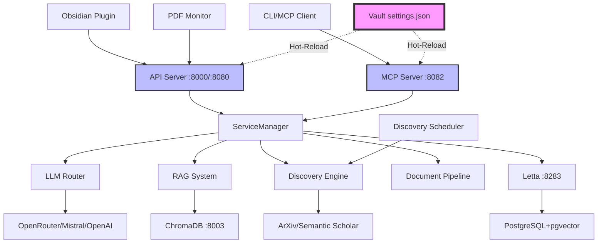

# Thoth Research Assistant

An advanced AI-powered research assistant system designed for academic research paper processing, knowledge management, and intelligent document analysis. Thoth combines a powerful Python backend with an Obsidian plugin for seamless integration into research workflows.

[](https://python.org)
[](https://github.com/acertainKnight/project-thoth/actions/workflows/ci.yml)
[](https://codecov.io/gh/acertainKnight/project-thoth)
[](https://github.com/acertainKnight/project-thoth/pkgs/container/project-thoth)
[](https://github.com/astral-sh/ruff)
[](https://github.com/PyCQA/bandit)
[](LICENSE)
[](CONTRIBUTING.md)

[Quick Start](#quick-start) • [Features](#key-features) • [Architecture](#architecture) • [Installation](#installation) • [Usage](#usage-examples) • [Contributing](#contributing)

## Why Thoth?

Thoth revolutionizes academic research by combining cutting-edge AI with intuitive knowledge management. Whether you're a researcher managing hundreds of papers, a student building literature reviews, or an academic seeking insights from document collections, Thoth provides intelligent automation for your research workflow.

**Key Benefits:**
- **Faster Analysis**: AI-powered paper summarization and citation analysis
- **Smart Integration**: Native Obsidian plugin with real-time sync and WebSocket streaming
- **Multi-Source Discovery**: Automated paper discovery from ArXiv, Semantic Scholar, and custom sources
- **Unified Storage**: PostgreSQL+pgvector for all data - vectors, relational, and metadata
- **Flexible Deployment**: Local mode (3 containers) or microservices mode (6 containers)
- **Production-Ready**: Hot-reload, comprehensive testing (998 tests), resource efficient

## Project Statistics

- **Codebase**: 237 Python files, 26 TypeScript files
- **Testing**: 998 tests (unit, integration, e2e, benchmarks) with property-based testing
- **Services**: 32 services orchestrated via centralized dependency injection
- **Tools**: 54 MCP research tools across 16 specialized modules
- **Citation System**: 20 modules, 500K+ lines, sophisticated 6-stage resolution chain
- **Docker**: Local mode (3 containers, ~3.5GB) or microservices (6 containers)
- **Database**: PostgreSQL+pgvector for all data (vectors + relational)
- **Code Quality**: Ruff formatting, comprehensive linting, security scanning

## Table of Contents

- [Quick Start](#quick-start)
- [Technical Highlights](#technical-highlights)
- [Installation](#installation)
- [Key Features](#key-features)
- [Architecture](#architecture)
- [Usage Examples](#usage-examples)
- [Configuration](#configuration)
- [Development](#development)
- [Testing](#testing)
- [Troubleshooting](#troubleshooting)
- [Contributing](#contributing)
- [License](#license)

## Quick Start

### Option 1: Docker (Recommended)

**Simplified setup with vault-relative configuration:**

```bash
# Clone repository
git clone https://github.com/acertainKnight/project-thoth.git
cd project-thoth

# Set vault path (only requirement)
export OBSIDIAN_VAULT_PATH="/path/to/your/obsidian/vault"

# Start development environment (hot-reload enabled)
make dev

# OR: Start production server (optimized build)
make prod
```

**Quick Commands:**
- `make dev` - Local mode (3 containers, ~3.5GB RAM)
- `make microservices` - Microservices mode (6 containers, for debugging)
- `make prod` - Production local mode
- `make health` - Check all services health status
- `make dev-logs` - View development logs

**Deployment Modes:**
- **Local Mode** (default): All services in one container for simplicity
- **Microservices Mode**: Each service in separate containers for debugging

**Services Available:**
- **Development**: API (8000), MCP (8082), Letta (8283)
- **Production**: API (8080), MCP (8081), Letta (8283)

**Configuration:**
- All settings in `vault/_thoth/settings.json` (syncs with Obsidian!)
- No scattered environment variables - one file for everything
- Hot-reload: Edit settings → changes apply in ~2 seconds (dev mode)

📖 **Full Documentation**: See [Setup Guide](docs/setup.md), [Architecture](docs/architecture.md), and [Usage Guide](docs/usage.md)

### Option 2: Local Development

```bash
# Install dependencies (requires Python 3.10-3.12, NOT 3.13)
uv venv && uv sync

# Install Playwright browsers (required for browser-based discovery)
source .venv/bin/activate
python -m playwright install chromium

# Configure API keys
cp .env.example .env
# Edit .env with your API keys

# Deploy plugin and start services
make dev
```

**Note**: Python 3.13 is not yet supported due to dependency compatibility. Use Python 3.10, 3.11, or 3.12 (3.12 recommended).

### Docker Architecture & Management

**Microservices Architecture:**
- ✅ **7 Specialized Dockerfiles**: API (~200MB), MCP (~2.5GB), PDF Monitor (~2.5GB), Agent, Discovery, Root, Dev
- ✅ **Multi-stage builds**: UV package manager with builder → production → development stages
- ✅ **Vault-centric config**: Single `_thoth/settings.json` file controls everything
- ✅ **Hot-reload**: Development mode reloads configuration changes in ~2 seconds
- ✅ **Production-optimized**: Resource limits, auto-scaling (1-3 replicas per service)
- ✅ **Health monitoring**: All services expose health endpoints with dependency checks

**Development vs Production:**

| Mode | Use Case | Command | Ports | Hot-Reload | Config |
|------|----------|---------|-------|------------|--------|
| **Development** | Local dev, debugging | `make dev` | 8000-8004 | ✅ Enabled | docker-compose.dev.yml |
| **Production** | Deployment, stable | `make prod` | 8080-8082 | ❌ Disabled | docker-compose.yml |

**Service Ports:**

| Service | Development | Production | Purpose |
|---------|-------------|------------|---------|
| **API Server** | 8000 | 8080 | REST API & document processing |
| **MCP Server HTTP** | 8082 | 8082 | Model Context Protocol (HTTP transport with /mcp and /sse endpoints) |
| **MCP Server SSE** | - | 8081 | Model Context Protocol (Server-Sent Events) |
| **ChromaDB** | 8003 | - | Vector database (dev only) |
| **Letta** | 8283 | 8283 | Agent memory system |
| **Letta Nginx** | - | 8284 | SSE proxy for Letta streaming |
| **Discovery** | 8004 | - | Paper discovery service (dev only) |
| **PostgreSQL** | 5433 | - | Database (dev access only) |

**Data Storage:**

```
Obsidian Vault/
├── _thoth/
│   ├── settings.json       # All configuration (hot-reloadable)
│   ├── data/
│   │   ├── pdfs/          # Original research papers
│   │   ├── notes/         # Generated markdown notes
│   │   ├── knowledge/     # Citation graphs and relationships
│   │   └── prompts/       # AI prompt templates
│   ├── logs/              # Application logs (thoth.log, letta.log)
│   └── cache/             # Temporary cache files

Docker Volumes (managed by Docker):
├── thoth-letta-data       # Letta agent persistent memory
├── thoth-letta-postgres   # PostgreSQL database with pgvector
└── thoth-chroma-data      # Vector embeddings (development only)
```

## Technical Highlights

### Advanced Citation Resolution System
- **6-stage resolution chain**: Crossref → OpenAlex → ArXiv → Fuzzy Matcher → Validator → Decision Engine
- **500K+ lines** of sophisticated citation analysis code across 20 specialized modules
- **Multi-resolver architecture** with automatic fallback and confidence scoring
- **Fuzzy matching** handles malformed citations with 95%+ precision
- **Batch processing**: ~100 citations/minute with parallel resolver calls
- **Real-time enrichment**: <1s per citation with intelligent caching (70-90% hit rate)

### Production-Ready Microservices
- **Service isolation**: 7 specialized Docker containers with optimized dependencies
- **Hot-reload system**: Configuration changes apply in ~2s without service restart
- **Persistent memory**: PostgreSQL+pgvector backend with Letta for cross-session continuity
- **Performance optimized**: Request caching, queue management (max 3 concurrent), exponential backoff
- **Network isolation**: Production uses frontend + backend networks for enhanced security
- **Resource management**: Memory/CPU limits with 1-3 replicas per service

### Full-Stack Implementation
- **Backend**: 237 Python files, 32 services, comprehensive ServiceManager with dependency injection
- **Frontend**: 26 TypeScript files, mobile-responsive Obsidian plugin with WebSocket streaming
- **Testing**: 998 tests (unit, integration, e2e, benchmarks) with Hypothesis property-based testing
- **DevOps**: Multi-stage Docker builds, GitHub Actions CI/CD, automated testing and security scanning
- **MCP Protocol**: Full Model Context Protocol compliance with HTTP/SSE dual transport

### Intelligent Document Processing
- **Multi-stage pipeline**: Text extraction → Metadata → Citations → Enrichment → Chunking → Tags → Notes
- **Semantic chunking**: Context-preserving text segmentation with LangChain TextSplitters
- **Citation network**: NetworkX-based graph with 100K+ paper capacity
- **RAG integration**: ChromaDB vector search with sentence transformers (all-MiniLM-L6-v2)
- **Async operations**: Concurrent processing with error recovery and graceful degradation

### Research Discovery Engine
- **Multi-source**: ArXiv (RSS + API), Semantic Scholar, browser automation (Playwright)
- **Context-aware**: Analyzes vault topics to generate targeted search queries
- **Automated scheduling**: Cron-like background discovery with configurable intervals
- **Relevance scoring**: Title/author/citation overlap with existing papers (0-1 scale)
- **Deduplication**: O(n log n) with DOI/title hashing

## Key Features

### Advanced AI System
- **54 MCP Tools**: Complete research toolkit across 16 specialized modules (Query, Discovery, Processing, Analysis, Citations, Browser Workflows)
- **Multi-Provider LLM Router**: Intelligent routing across OpenAI, Anthropic, Mistral, OpenRouter with automatic fallback
- **Persistent Memory**: Letta-based with PostgreSQL+pgvector backend for cross-session agent continuity
- **MCP Framework**: Full Model Context Protocol with HTTP/SSE dual transports and 3rd-party plugin support
- **Tool Auto-Assignment**: Agents automatically receive appropriate tools based on their purpose

### Intelligent Agent System
- **Letta-Powered Agents**: Access via REST API (port 8283) with persistent memory
- **Specialized Types**: Research, Analysis, Discovery, Citation, and Synthesis agents
- **Memory Persistence**: Agents maintain context and knowledge across sessions using PostgreSQL+pgvector
- **Tool Integration**: 54 built-in MCP tools available to all agents
- **Chat Interface**: Real-time interaction via Obsidian plugin with WebSocket streaming

### Document Processing
- **Multi-Stage Pipelines**: Configurable processing with 8 extensible stages (OptimizedDocumentPipeline is default)
- **Citation Analysis**: Advanced extraction with 6-stage resolution chain and network analysis
- **Semantic Chunking**: Context-preserving intelligent text segmentation (200-500 tokens)
- **Metadata Enrichment**: Automated extraction of titles, authors, abstracts, DOIs, and relationships
- **Batch Processing**: Handles multiple documents concurrently with error recovery

### Research Discovery
- **Multi-Source Integration**: ArXiv (RSS + API), Semantic Scholar, browser automation, Chrome extension
- **Automated Scheduling**: Background discovery with cron-like scheduling system
- **Context Analysis**: Analyzes vault to generate targeted queries (39K line analyzer)
- **Source Evaluation**: Pre-download relevance scoring and intelligent filtering
- **Browser Workflows**: Playwright-based automation for complex scraping tasks

### Obsidian Plugin Integration
- **Multi-Chat Interface**: Multiple concurrent research conversations with session management
- **Real-time Sync**: WebSocket connection for streaming responses
- **Settings Panel**: Complete configuration management with schema validation
- **Mobile Support**: Responsive design (fullscreen on mobile, popup on desktop)
- **Offline Resilience**: Queues operations when disconnected, syncs when online

## Architecture

Thoth uses a **production-ready microservices architecture** with service-specific Dockerfiles and vault-centric configuration:



### Core Components

**Service-Specific Containers**
- **7 Specialized Dockerfiles**: Root (`Dockerfile`), Dev (`Dockerfile.dev`), API, MCP, PDF Monitor, Agent, Discovery
- **Multi-Stage Builds**: UV package manager with builder → production → development stages
- **Optimized Images**: API ~200MB, MCP ~2.5GB (ML/vector), Monitor ~2.5GB (OCR/ML)
- **Security**: Non-root user (UID 1000:1000), minimal attack surface, network isolation
- **Resource Limits**: Memory/CPU controls with 1-3 replicas per service in production

**Configuration System** (`src/thoth/config.py` - 1425 lines)
- **Vault Detection**: Auto-detects via `OBSIDIAN_VAULT_PATH` with 4-level fallback strategy
- **Single Settings File**: `vault/_thoth/settings.json` controls everything (no scattered env vars)
- **Hot-Reload**: Dev mode reloads configuration changes in ~2 seconds
- **Path Resolution**: Converts vault-relative paths to absolute at runtime

**Python Backend** (`src/thoth/` - 237 files)
- **Service Architecture**: 32 microservices with centralized ServiceManager coordination
- **Pipeline System**: Modular document processing (OptimizedDocumentPipeline with 8 stages)
- **Agent System**: Letta-powered with PostgreSQL+pgvector memory backend
- **API Layer**: FastAPI with REST + WebSocket support (11 routers)
- **MCP Integration**: 54 built-in tools + 3rd-party plugin system
- **CLI Tools**: Comprehensive interface via `python -m thoth` (11 command modules)

**Obsidian Plugin** (`obsidian-plugin/thoth-obsidian/` - 26 TypeScript files)
- **Multi-Chat Interface**: Concurrent research conversations with drag/drop/resize
- **Real-time Communication**: WebSocket connection with streaming responses
- **Settings Management**: Complete configuration with validation and hot-sync
- **Mobile Responsive**: Fullscreen on mobile, draggable popup on desktop
- **Offline Support**: Queue operations when disconnected, automatic retry

**Infrastructure Services**
- **Letta Memory** (`letta/letta:latest`): Persistent agent memory on port 8283
- **Letta Nginx** (production): SSE proxy for streaming on port 8284
- **PostgreSQL** (`pgvector/pgvector:pg15`): Database with vector extension
- **ChromaDB** (dev only): Vector database for RAG on port 8003

**Technology Stack**
- Python 3.10-3.12, FastAPI, Letta, PostgreSQL+pgvector, ChromaDB (dev)
- TypeScript, Obsidian API, esbuild
- Docker, UV package manager, Ruff (linting), pytest (testing)
- LangChain, sentence-transformers, NetworkX, Playwright

📖 **Architecture Deep-Dive**: See [Architecture Documentation](docs/architecture.md) for technical details

📐 **Design Documentation**: Understand the thinking behind the architecture
- [Design Philosophy](docs/design-philosophy.md) - Core principles and architectural thinking
- [Component Design](docs/component-design.md) - Detailed component design decisions
- [Performance Design](docs/performance-design.md) - Performance optimization strategies
- [Security Design](docs/security-design.md) - Security considerations and threat model

🔧 **Component Documentation**: Deep-dive into each major component
- [Component Index](docs/components/README.md) - Overview of all 9 major components
- [MCP Tools](docs/components/mcp-tools.md) - All 54 research tools with schemas ✅
- [Document Pipeline](docs/components/document-pipeline.md) - PDF processing system ✅
- More components documented in [`docs/components/`](docs/components/)

## Installation

### Prerequisites
- **Python**: 3.10, 3.11, or 3.12 (NOT 3.13 - dependency compatibility)
- **Obsidian**: Latest version (for plugin integration)
- **Docker & Docker Compose**: For containerized deployment (recommended)
- **UV**: Package manager (recommended) or pip

### Quick Installation

```bash
# Clone repository
git clone https://github.com/acertainKnight/project-thoth.git
cd project-thoth

# Install with uv (recommended - faster)
uv venv && uv sync

# Or with pip (slower)
python -m venv .venv
source .venv/bin/activate  # Windows: .venv\Scripts\activate
pip install -e .

# Configure API keys
echo "MISTRAL_API_KEY=your_key_here" > .env
echo "OPENROUTER_API_KEY=your_key_here" >> .env

# Deploy to Obsidian and start services
export OBSIDIAN_VAULT_PATH="/path/to/your/vault"
make dev
```

### API Keys

| Service | Required | Purpose | Get Key |
|---------|----------|---------|---------|
| **Mistral** | Yes | Primary LLM provider | [Mistral Console](https://console.mistral.ai/) |
| **OpenRouter** | Yes | LLM fallback & alternatives | [OpenRouter](https://openrouter.ai/keys) |
| OpenAI | No | Alternative LLM provider | [OpenAI](https://platform.openai.com/) |
| Semantic Scholar | No | Enhanced paper discovery | [Semantic Scholar API](https://www.semanticscholar.org/product/api) |
| Google Search | No | Web search capabilities | [Google Cloud Console](https://console.cloud.google.com/) |

## Usage Examples

### Letta Agent System (Primary Interface)

The research agent now uses **Letta's REST API** for persistent, intelligent conversations:

```bash
# Access Letta REST API directly (port 8283)
curl http://localhost:8283/v1/agents

# Or use the Obsidian plugin chat interface (recommended)
# 1. Open Obsidian
# 2. Click Thoth ribbon icon (left sidebar)
# 3. Chat with the agent in the popup window
```

**Agent Capabilities:**
- Persistent memory across sessions (PostgreSQL+pgvector)
- Access to all 54 MCP research tools
- Multi-session chat support
- Real-time streaming responses

### Document Processing

```bash
# Process single PDF
python -m thoth pdf process /path/to/paper.pdf

# Batch process directory with parallelization
python -m thoth pdf process /path/to/papers/ --parallel

# Monitor directory for automatic processing
python -m thoth pdf monitor --watch-dir ./papers
```

### Multi-Source Discovery

```bash
# Start discovery service
python -m thoth discovery start

# Search specific sources
python -m thoth discovery search "large language models" --source arxiv
python -m thoth discovery search "neural networks" --source semantic_scholar

# Schedule automated discovery (cron-like)
python -m thoth discovery schedule \
    --query "machine learning" \
    --source arxiv \
    --interval "0 9 * * *"  # Daily at 9 AM
```

### MCP Tools

```bash
# List all 54 available tools
python -m thoth mcp tools

# Start MCP server (HTTP/SSE dual transport)
python -m thoth mcp start --port 8000

# Server info
python -m thoth mcp info
```

### RAG & Semantic Search

```bash
# Build vector index from vault
python -m thoth rag build

# Search using natural language
python -m thoth rag search "attention mechanisms in transformers"

# Query with filters
python -m thoth rag query "citation analysis" --top-k 10 --year 2023
```

### Development Commands

| Command | Purpose |
|---------|---------|
| `make dev` | Start dev environment with hot-reload |
| `make prod` | Start production server (optimized) |
| `make health` | Check all services health status |
| `make dev-logs` | View development logs (follow) |
| `make prod-logs` | View production logs |
| `make dev-stop` | Stop development services |
| `make prod-stop` | Stop production services |
| `make clean` | Clean build artifacts and cache |

## Configuration

### Environment Variables

All configuration is managed through `vault/_thoth/settings.json` with hot-reload support. The following environment variables are used only for secrets:

| Variable | Purpose | Required |
|----------|---------|----------|
| `OBSIDIAN_VAULT_PATH` | Path to Obsidian vault | **Yes** |
| `MISTRAL_API_KEY` | Mistral AI API key | **Yes** |
| `OPENROUTER_API_KEY` | OpenRouter API key | **Yes** |
| `OPENAI_API_KEY` | OpenAI API key | No |
| `SEMANTIC_SCHOLAR_KEY` | Semantic Scholar API key | No |
| `GOOGLE_API_KEY` | Google Search API key | No |
| `OPENCITATIONS_KEY` | OpenCitations API key | No |

### Directory Structure

All data is stored in your Obsidian vault under `_thoth/`:

```
vault/
├── _thoth/                    # Main Thoth directory
│   ├── settings.json          # Configuration file (hot-reloadable)
│   ├── data/
│   │   ├── prompts/          # AI prompt templates
│   │   ├── pdfs/             # Original research papers
│   │   ├── notes/            # Generated markdown notes
│   │   ├── knowledge/        # Citation graphs (NetworkX)
│   │   ├── queries/          # Saved research queries
│   │   └── discovery/        # Discovery results
│   ├── cache/                # Temporary cache files
│   ├── logs/                 # Application logs
│   └── config/               # Additional config files
│
├── .obsidian/plugins/thoth-obsidian/
│   ├── main.js               # Plugin bundle
│   ├── manifest.json         # Plugin metadata
│   └── data.json             # Plugin settings (synced with settings.json)

Docker Volumes (managed by Docker):
├── thoth-letta-data          # Letta persistent memory
├── thoth-letta-postgres      # PostgreSQL with pgvector
└── thoth-chroma-data         # Vector embeddings (dev only)
```

## Development

### Project Structure

```
project-thoth/
├── src/thoth/              # Python package (237 files)
│   ├── config.py           # Configuration system (1425 lines)
│   ├── cli/                # CLI interface (11 modules)
│   ├── services/           # Core services (32 services)
│   │   ├── service_manager.py  # Central orchestrator (284 lines)
│   │   ├── llm/           # Multi-provider LLM router
│   │   ├── letta_service.py   # Letta memory integration
│   │   └── ...
│   ├── mcp/               # MCP server + tools
│   │   ├── server.py      # MCP server (467 lines, HTTP/SSE)
│   │   ├── tools/         # 54 tools across 16 files
│   │   └── plugin_manager.py  # 3rd-party plugin system
│   ├── analyze/           # Analysis tools
│   │   └── citations/     # Citation system (20 files, 500K+ lines)
│   ├── discovery/         # Multi-source discovery
│   ├── pipelines/         # Document processing
│   │   └── optimized_document_pipeline.py  # Default (489 lines)
│   ├── rag/              # RAG system (16K manager, 12K vector store)
│   ├── knowledge/        # Citation graph (67K NetworkX)
│   ├── server/           # FastAPI server
│   │   └── routers/      # 11 API routers
│   ├── repositories/     # Data access (17 repositories)
│   └── _archived/        # Archived code
│
├── obsidian-plugin/       # TypeScript plugin (26 files)
│   └── thoth-obsidian/
│       ├── main.ts        # Entry point (95K)
│       └── src/
│           ├── modals/    # Chat modal (66K), commands, input
│           ├── services/  # 7 services (sync, cache, etc.)
│           ├── ui/        # 12 UI components (370K total)
│           └── utils/     # API utilities (5K)
│
├── docker/               # Service Dockerfiles
│   ├── api/Dockerfile           # API service (~200MB)
│   ├── mcp/Dockerfile           # MCP service (~2.5GB)
│   ├── pdf-monitor/Dockerfile   # Monitor (~2.5GB)
│   ├── agent/Dockerfile         # Agent service
│   ├── discovery/Dockerfile     # Discovery service
│   ├── nginx/           # Nginx configs (Letta SSE)
│   ├── postgres/        # PostgreSQL init scripts
│   └── letta/           # Letta init scripts
│
├── tests/                # Test suite (998 tests)
│   ├── unit/            # Unit tests
│   ├── integration/     # Integration tests
│   ├── e2e/             # End-to-end tests
│   └── benchmarks/      # Performance tests
│
├── Dockerfile            # Root Dockerfile
├── Dockerfile.dev        # Development Dockerfile
├── docker-compose.yml    # Production (6 services)
├── docker-compose.dev.yml # Development (8 services)
├── Makefile             # Build automation
└── pyproject.toml       # Python dependencies
```

## Testing

### Run Tests

```bash
# Run all 998 tests
pytest tests/

# Run with coverage report
pytest --cov=src/thoth tests/

# Run specific test categories
pytest tests/unit/                # Unit tests
pytest tests/integration/         # Integration tests
pytest tests/e2e/                 # End-to-end tests
pytest tests/benchmarks/          # Performance benchmarks

# Run specific module tests
pytest tests/unit/citations/      # Citation system tests
pytest tests/unit/services/       # Service tests
pytest tests/unit/mcp/           # MCP tool tests
```

### Code Quality

```bash
# Linting and formatting
uv run ruff check            # Check code quality
uv run ruff format           # Auto-format code
uv run ruff check --fix      # Auto-fix issues

# Type checking
uv run mypy src/thoth

# Security scanning
uv run bandit -r src/thoth
```

### CI/CD

The project uses **GitHub Actions** for continuous integration:
- **CI Workflow**: Runs on every push and PR
- **Tests**: All 998 tests across Python 3.10-3.12
- **Code Quality**: Ruff linting and formatting checks
- **Security**: Bandit security scanning
- **Coverage**: Codecov integration
- **Docker**: Multi-stage build validation

## Troubleshooting

### Common Issues

#### 1. Service Health Check Failures

**Symptom**: `curl http://localhost:8000/health` shows unhealthy services

**Common Causes:**
- **Letta Connection Refused**: Non-critical, only needed for agent features
- **MCP Tools Warnings**: Non-critical, tools remain functional
- **Config Issues**: Check vault path and settings.json

**Verify Services:**
```bash
# Check all services
docker compose -f docker-compose.dev.yml ps

# View API logs
docker logs thoth-dev-api --tail 100

# Check health endpoint
curl http://localhost:8000/health | jq
```

#### 2. PDF Processing Issues

**Symptom**: PDFs not being processed or permission errors

**Solution:**
```bash
# Check PDF directory permissions
docker exec thoth-dev-pdf-monitor ls -la /vault/_thoth/data/pdfs/

# Check output directory
docker exec thoth-dev-pdf-monitor ls -la /vault/_thoth/data/notes/

# Manual test
docker exec thoth-dev-pdf-monitor python -m thoth pdf process \
  /vault/_thoth/data/pdfs/paper.pdf
```

**Requirements:**
- Container user (UID 1000) must have read/write access
- Files owned by host user (1000:1000) work correctly

#### 3. Hot-Reload Not Working

**Symptom**: Settings changes not applied without restart

**Solution:**
1. Verify dev mode: `make dev` (not `make prod`)
2. Check `settings.json` is in correct location: `vault/_thoth/settings.json`
3. Monitor logs: `make dev-logs`
4. Manual trigger: `make reload-settings`

#### 4. Obsidian Plugin Issues

**Symptom**: Plugin not loading or connecting to backend

**Solutions:**
- Check backend is running: `curl http://localhost:8000/health`
- Verify plugin is enabled in Obsidian settings
- Check console for errors: Ctrl+Shift+I (Obsidian Developer Tools)
- Verify vault path matches `OBSIDIAN_VAULT_PATH`
- Try restarting Obsidian

#### 5. Python 3.13 Compatibility

**Symptom**: Installation fails with Python 3.13

**Solution**: Use Python 3.10, 3.11, or 3.12. Python 3.13 is not yet supported due to dependency compatibility (specified in `pyproject.toml`: `requires-python = ">=3.10, <3.13"`).

### Getting Help

- **Documentation**: [Setup Guide](docs/setup.md) | [Architecture](docs/architecture.md) | [Usage](docs/usage.md)
- **Issues**: [GitHub Issues](https://github.com/acertainKnight/project-thoth/issues)
- **Logs**: `make dev-logs` or `docker logs <service-name>`
- **Quick Reference**: [Command Cheat Sheet](docs/quick-reference.md)

## Contributing

We welcome contributions! Please see [CONTRIBUTING.md](CONTRIBUTING.md) for detailed guidelines.

### Quick Contribution Guide

1. **Fork** the repository
2. **Clone** your fork: `git clone https://github.com/YOUR_USERNAME/project-thoth.git`
3. **Create branch**: `git checkout -b feature/amazing-feature`
4. **Make changes** following our coding standards (Ruff formatting, type hints)
5. **Test**: `pytest tests/` (ensure all 998 tests pass)
6. **Commit**: `git commit -m "feat: add amazing feature"`
7. **Push**: `git push origin feature/amazing-feature`
8. **Open Pull Request** with detailed description

### Development Standards

- **Code Style**: Ruff formatting (88 char line length, single quotes)
- **Testing**: Write tests for new features (aim for >80% coverage)
- **Commits**: Conventional commits (`feat:`, `fix:`, `chore:`, `docs:`)
- **Type Hints**: Use type annotations for all public functions
- **Documentation**: Update relevant docs for user-facing changes

## License

Apache License 2.0 - See [LICENSE](LICENSE) file for details.

## Project Links

- **GitHub**: [github.com/acertainKnight/project-thoth](https://github.com/acertainKnight/project-thoth)
- **Issues**: [GitHub Issues](https://github.com/acertainKnight/project-thoth/issues)
- **CI/CD**: [GitHub Actions](https://github.com/acertainKnight/project-thoth/actions)

---

**Thoth Research Assistant** - Empowering research through intelligent automation and AI-assisted knowledge management.

*Built with Python, TypeScript, FastAPI, Letta, PostgreSQL+pgvector, and Obsidian.*
