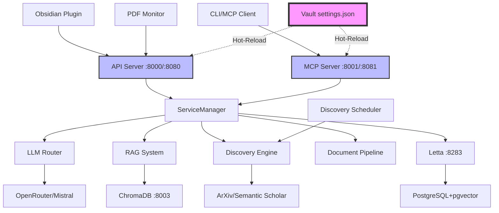

# Thoth Research Assistant

An advanced AI-powered research assistant system designed for academic research paper processing, knowledge management, and intelligent document analysis. Thoth combines a powerful Python backend with an Obsidian plugin for seamless integration into research workflows.

[](https://python.org)
[](LICENSE)
[](CONTRIBUTING.md)

[Quick Start](#quick-start) • [Installation](#installation) • [Usage](#usage-examples) • [Contributing](#contributing)

## Why Thoth?

Thoth revolutionizes academic research by combining cutting-edge AI with intuitive knowledge management. Whether you're a researcher managing hundreds of papers, a student building literature reviews, or an academic seeking insights from document collections, Thoth provides intelligent automation for your research workflow.

**Key Benefits:**
- **Faster Analysis**: AI-powered paper summarization and analysis
- **Smart Integration**: Native Obsidian plugin with real-time sync
- **Multi-Source Discovery**: Automated paper discovery from ArXiv, Semantic Scholar, and more
- **Persistent Memory**: Advanced agent system with cross-session memory

## Table of Contents

- [Quick Start](#quick-start)
- [Installation](#installation)
- [Key Features](#key-features)
- [Architecture](#architecture)
- [Usage Examples](#usage-examples)
- [Configuration](#configuration)
- [Development](#development)
- [Contributing](#contributing)
- [License](#license)

## Quick Start

### Option 1: Docker (Recommended)

**New simplified setup with vault-relative configuration!**

```bash
# Clone repository
git clone https://github.com/acertainKnight/project-thoth.git
cd project-thoth

# Set vault path (only requirement)
export OBSIDIAN_VAULT_PATH="/path/to/your/obsidian/vault"

# Start development environment (hot-reload enabled)
make dev

# OR: Start production server (optimized build)
make prod
```

**Quick Start Commands:**
- `make dev` - Development mode with hot-reload and debug logging
- `make prod` - Production mode with optimized containers
- `make health` - Check all services are running
- `make dev-logs` - View development logs

**Services Available:**
- **Development**: API (8000), MCP (8001), ChromaDB (8003), Letta (8283)
- **Production**: API (8080), MCP (8081), ChromaDB (8003), Letta (8283)

**Configuration:**
- All settings in `vault/_thoth/settings.json` (syncs with Obsidian!)
- No scattered environment variables - one file for everything
- Hot-reload: Edit settings → changes apply in ~2 seconds (dev mode)

📖 **Full Documentation**: See [Docker Quick Start Guide](docs/DOCKER-QUICKSTART.md)

### Option 2: Local Development
```bash
# Install dependencies (requires Python 3.10+)
uv venv && uv sync

# Configure API keys
cp .env.example .env
# Edit .env with your API keys

# Deploy plugin and start services
make dev OBSIDIAN_VAULT="/path/to/vault"
```

### Docker Architecture & Management

**Single Unified Dockerfile Approach:**
- ✅ One Dockerfile for all services (API, MCP, Discovery, PDF Monitor)
- ✅ Multi-stage builds (builder → runtime → development)
- ✅ Vault-relative configuration (single settings.json)
- ✅ Hot-reload in development mode
- ✅ Production-optimized with resource limits

**Development vs Production:**

| Mode | Use Case | Command | Ports | Hot-Reload | Config |
|------|----------|---------|-------|------------|--------|
| **Development** | Local dev, debugging | `make dev` | 8000-8004 | ✅ Enabled | docker-compose.dev.yml |
| **Production** | Deployment, production | `make prod` | 8080-8081 | ❌ Disabled | docker-compose.yml |

**Quick Start Commands:**

```bash
# Development (Hot-Reload Enabled)
make dev                # Start dev environment
make dev-logs           # View logs (follow mode)
make dev-stop           # Stop development
make health             # Health check all services

# Production (Optimized, Stable)
make prod               # Start production server
make prod-logs          # View production logs
make prod-stop          # Stop production
make prod-restart       # Restart with zero downtime

# Hot-Reload (Development Only)
make reload-settings    # Manually trigger reload
make watch-settings     # Monitor settings changes
make test-hot-reload    # Test hot-reload end-to-end
```

**Service Ports:**

| Service | Development | Production | Purpose |
|---------|-------------|------------|---------|
| **API Server** | 8000 | 8080 | REST API & document processing |
| **MCP Server** | 8001 | 8081 | Model Context Protocol |
| **ChromaDB** | 8003 | 8003 | Vector database (RAG) |
| **Letta** | 8283 | 8283 | Agent memory system |
| **Discovery** | 8004 | - | Paper discovery (dev only) |

**Architecture Highlights:**

- **Single Dockerfile**: All services use the same optimized image
- **Vault-Centric**: All data in `$OBSIDIAN_VAULT_PATH/_thoth/`
- **Settings Management**: Single `settings.json` controls everything
- **Hot-Reload**: Development mode reloads on settings changes (~2s)
- **Resource Limits**: Production mode includes memory/CPU limits
- **Health Checks**: All services have health endpoints

**Data Storage:**

```
Obsidian Vault/
├── _thoth/
│   ├── settings.json       # All configuration (hot-reloadable)
│   ├── data/
│   │   ├── pdfs/          # Original papers
│   │   ├── notes/         # Generated notes
│   │   ├── knowledge/     # Citation graphs
│   │   └── prompts/       # AI prompt templates
│   ├── logs/              # Application logs
│   └── cache/             # Temporary cache

Docker Volumes (managed by Docker):
├── thoth-letta-data       # Letta agent memory
├── thoth-letta-postgres   # PostgreSQL database
└── thoth-chroma-data      # Vector embeddings
```

📖 **Complete Guides:**
- [Production Deployment](docs/PRODUCTION-DEPLOYMENT.md) - Full deployment guide
- [Quick Start](docs/QUICK-START.md) - 5-minute setup
- [Architecture](docs/architecture.md) - Technical details
- [Docker Quick Reference](docs/DOCKER-QUICKSTART.md) - Docker commands
- [Hot-Reload Guide](docs/HOT-RELOAD-GUIDE.md) - Development workflow
- [Docker System Status](docs/DOCKER-SYSTEM-STATUS-REPORT.md) - Latest system health and bug fixes

## Key Features

### Advanced AI System
- **52 MCP Tools**: Complete research assistant toolkit (100% functional)
- **3rd Party MCP Plugins**: VSCode-compatible plugin system for extending capabilities
- **Multi-Provider LLM Router**: Intelligent routing across OpenAI, Anthropic, Mistral, OpenRouter
- **Persistent Memory**: Letta-based with salience retention and cross-session persistence
- **MCP Framework**: Full Model Context Protocol with HTTP/stdio/SSE transports

### Intelligent Agent System
- **Dynamic Agent Creation**: `"create an agent that analyzes citation patterns"`
- **@Agent Interactions**: `"@citation-analyzer analyze this paper's references"`
- **Specialized Agent Types**: Research, Analysis, Discovery, Citation, and Synthesis agents
- **Tool Auto-Assignment**: Agents automatically receive appropriate tools based on their purpose
- **Memory Persistence**: Agents maintain context and knowledge across sessions

### Document Processing
- **Multi-Stage Pipelines**: Configurable processing with extensible stages
- **Citation Analysis**: Advanced extraction with network analysis capabilities
- **Semantic Chunking**: Context-preserving intelligent text segmentation
- **Metadata Enrichment**: Automated extraction of academic metadata and relationships

### Research Discovery
- **Multi-Source Integration**: ArXiv, Semantic Scholar, and web search
- **Chrome Extension Bridge**: Real-time paper collection from browser
- **Automated Scheduling**: Background discovery with configurable intervals
- **Source Evaluation**: Pre-download relevance scoring and filtering

## Architecture

Thoth uses a **production-ready microservices architecture** with a single unified Dockerfile and vault-centric configuration:



### Core Components

**Single Unified Container** (Dockerfile)
- **Multi-Stage Build**: Optimized builder → runtime → development stages
- **All Services**: API, MCP, Discovery, PDF Monitor in one image
- **Security**: Non-root user, minimal attack surface
- **Resource Limits**: Memory and CPU controls in production

**Configuration System** (`src/thoth/config.py`)
- **Vault Detection**: Auto-detects Obsidian vault via `OBSIDIAN_VAULT_PATH`
- **Single Settings File**: `vault/_thoth/settings.json` controls everything
- **Hot-Reload**: Development mode reloads on settings changes
- **Path Resolution**: Converts vault-relative paths to absolute at runtime

**Python Backend** (`src/thoth/`)
- **Service Architecture**: Microservice-based with centralized ServiceManager
- **Pipeline System**: Modular, extensible document processing stages
- **Agent System**: Letta-powered with persistent memory and cross-session context
- **API Layer**: FastAPI server with REST + WebSocket support
- **MCP Integration**: Full Model Context Protocol (52 built-in tools + plugins)
- **CLI Tools**: Comprehensive command-line interface

**Obsidian Plugin** (`obsidian-plugin/thoth-obsidian/`)
- **Multi-Chat Interface**: Concurrent research conversations
- **Real-time Sync**: Live WebSocket connection to backend
- **Settings Panel**: Complete configuration management
- **Note Integration**: Direct interaction with vault files
- **Auto-updates**: Hot reload during development

**Infrastructure Services**
- **Letta Memory**: Persistent agent memory with salience retention
- **ChromaDB**: Vector database for semantic search and RAG
- **PostgreSQL**: Database backend for Letta with pgvector extension
- **Redis** (production): Session management and caching

**Technology Stack**: Python 3.11, FastAPI, Letta, ChromaDB, PostgreSQL+pgvector, TypeScript, Obsidian, Docker

📖 **Architecture Details**: See [Architecture Documentation](docs/architecture.md) for technical deep-dive

## Installation

### Prerequisites
- Python 3.10-3.12
- Obsidian (for plugin integration)
- uv (recommended) or pip

### Quick Installation

```bash
# Clone repository
git clone https://github.com/acertainKnight/project-thoth.git
cd project-thoth

# Install with uv (recommended)
uv venv && uv sync

# Or with pip
python -m venv .venv
source .venv/bin/activate  # Windows: .venv\Scripts\activate
pip install -e .

# Configure API keys
echo "MISTRAL_API_KEY=your_key_here" > .env
echo "OPENROUTER_API_KEY=your_key_here" >> .env

# Deploy to Obsidian and start services
make dev
```

### API Keys

| Service | Required | Purpose |
|---------|----------|---------|
| Mistral | Yes | Primary LLM provider |
| OpenRouter | Yes | LLM fallback |
| OpenAI | No | Alternative LLM |
| Semantic Scholar | No | Paper discovery |

Get keys from: [Mistral Console](https://console.mistral.ai/), [OpenRouter](https://openrouter.ai/keys)

## Usage Examples

### Interactive Research Session
```bash
# Start the research agent
python -m thoth agent

# Start with specific research focus
python -m thoth agent research --query "transformer architectures"
```

### Document Processing
```bash
# Process single PDF
python -m thoth pdf process /path/to/paper.pdf

# Batch process directory
python -m thoth pdf process /path/to/papers/ --parallel

# Monitor directory with real-time processing
python -m thoth monitor --watch-dir ./papers --optimized
```

### Multi-Source Discovery
```bash
# Start discovery service
python -m thoth discovery start

# Search specific sources
python -m thoth discovery search "large language models" --source arxiv
python -m thoth discovery search "neural networks" --source semantic_scholar
```

### Intelligent Agent System
```bash
# Create specialized agents through chat
"create an agent that analyzes citation patterns in research papers"
"make a discovery agent for machine learning papers"
"build an agent that helps with reference formatting"

# Interact with created agents using @mentions
"@citation-analyzer analyze the references in this paper"
"@ml-discovery find recent papers about transformer attention mechanisms"
"@reference-formatter format these citations in APA style"

# List and manage your agents
"list my agents"
"show available agents"
```

**Agent Types:**
- **Research**: General research assistance and literature reviews
- **Analysis**: Deep document analysis and critical evaluation
- **Discovery**: Multi-source paper finding and monitoring
- **Citation**: Citation extraction and bibliography management
- **Synthesis**: Knowledge integration and summary generation

### Development Commands

| Command | Purpose |
|---------|---------|
| `make deploy-and-start` | Complete deployment + start all services |
| `make deploy-plugin` | Deploy Obsidian plugin only |
| `make start` | Start all Docker services |
| `make stop` | Stop all services |
| `make restart` | Restart all services |
| `make status` | Check service health |
| `make logs` | View service logs |
| `make dev` | Start with live reload |
| `make clean` | Clean build artifacts |

## Configuration

### Environment Variables

| Category | Variable | Purpose | Required |
|----------|----------|---------|----------|
| AI | `MISTRAL_API_KEY` | Primary LLM provider | Yes |
| AI | `OPENROUTER_API_KEY` | LLM fallback/alternatives | Yes |
| AI | `OPENAI_API_KEY` | OpenAI models | No |
| Discovery | `SEMANTIC_SCHOLAR_KEY` | Academic paper metadata | No |
| Discovery | `GOOGLE_API_KEY` | Web search capabilities | No |
| Data | `OPENCITATIONS_KEY` | Citation data access | No |
| System | `THOTH_WORKSPACE_DIR` | Main working directory | No |
| System | `THOTH_PDF_DIR` | PDF storage location | No |
| Agents | `LETTA_SERVER_URL` | Letta server connection | No |
| Agents | `LETTA_ENABLE_AGENT_SYSTEM` | Enable agent orchestration | No |
| Agents | `LETTA_MAX_AGENTS_PER_USER` | Agent limit per user | No |

### Directory Structure

All configuration and data is stored in your Obsidian vault:

```
vault/
├── .thoth/
│   ├── data/
│   │   ├── prompts/          # 22+ AI prompt templates
│   │   ├── pdfs/            # Original documents
│   │   ├── notes/           # Generated notes
│   │   ├── knowledge/       # Citation graphs
│   │   ├── queries/         # Saved queries
│   │   ├── agents/          # Agent configurations
│   │   └── discovery/       # Discovery results
│   ├── cache/               # Temporary cache
│   ├── logs/                # Application logs
│   └── config/              # Configuration files
│
├── .obsidian/plugins/thoth/
│   ├── main.js                 # Plugin code
│   ├── manifest.json           # Plugin metadata
│   └── mcp-plugins.json       # 3rd party MCP configuration
│
└── .thoth.settings.json        # Main settings
```

## Development

### Project Structure
```
project-thoth/
├── src/thoth/              # Python package
│   ├── cli/               # Command-line interface
│   ├── services/          # Core services
│   │   ├── llm/          # Multi-provider LLM
│   │   ├── service_manager.py  # Central orchestrator
│   │   └── ...
│   ├── ingestion/
│   │   └── agent_v2/     # Modern agent system
│   ├── mcp/              # MCP server + tools
│   │   ├── server.py     # MCP server
│   │   ├── tools/        # 52 built-in tools
│   │   ├── plugin_manager.py  # 3rd party plugins
│   │   └── validation.py      # Plugin validation
│   ├── memory/           # Letta integration
│   ├── pipelines/        # Document processing
│   ├── rag/              # Vector retrieval
│   └── server/           # FastAPI server
│
├── obsidian-plugin/       # Obsidian integration
│   └── thoth-obsidian/
│       ├── src/          # TypeScript source
│       └── main.ts       # Entry point
│
├── docker/               # Docker configurations
│   ├── api/
│   ├── mcp/
│   └── discovery/
│
├── templates/            # File templates
├── Makefile             # Build commands (streamlined)
└── docker-compose.dev.yml  # Docker services
```

### Testing
```bash
# Run all tests
pytest tests/

# Run with coverage
pytest --cov=src/thoth tests/

# Run specific test categories
pytest tests/services/            # Service layer tests
pytest tests/agent_v2/            # Agent system tests
pytest tests/integration/         # Integration tests
```

### Code Quality
```bash
# Linting and formatting
uv run ruff check            # Check code quality
uv run ruff format           # Format code
uv run pytest               # Run tests
```

### Quick Contribution Guide

1. Fork the repository
2. Create a feature branch: `git checkout -b feature/amazing-feature`
3. Make your changes following our style guide
4. Test your changes: `pytest tests/`
5. Commit your changes: `git commit -m "Add amazing feature"`
6. Push to your branch: `git push origin feature/amazing-feature`
7. Open a Pull Request

## Advanced Features

### Multi-Agent Intelligence
- **Specialized Research Agents**: Dedicated agents for literature review, citation analysis, and concept extraction
- **Agent Orchestration**: Intelligent coordination between agents for complex research workflows
- **Memory Sharing**: Cross-agent knowledge sharing for comprehensive analysis

### Knowledge Graph Integration
- **Automatic Relationship Extraction**: AI-powered discovery of connections between papers and concepts
- **Visual Knowledge Mapping**: Interactive graph visualization of research relationships
- **Graph-Based Queries**: Semantic search through connected knowledge structures

### Performance & Scale
- **Async Processing**: Concurrent operations for handling multiple documents simultaneously
- **Smart Caching**: Intelligent caching of embeddings, analysis results, and API responses
- **Memory Management**: Efficient handling of large document collections and knowledge bases

## Troubleshooting

### Common Issues and Solutions

#### 1. Callback Signature Mismatches
**Symptom**: `TypeError: register_reload_callback() takes 2 positional arguments but 3 were given`

**Solution**: Ensure all config reload callbacks accept `config: Config` parameter:
```python
# Correct signature
def _on_config_reload(self, config: Config) -> None:
    # Handle config changes
    pass
```

**Files to check**:
- `src/thoth/services/llm_service.py`
- `src/thoth/services/letta_service.py`
- `src/thoth/rag/rag_manager.py`

#### 2. Slow Docker Builds
**Symptom**: Docker build takes 10-17 minutes longer than expected

**Solution**: Verify `Dockerfile` does NOT contain `chmod -R g+rX /app` (should be removed)
- Permissions are correctly set by `COPY --chown=thoth:thoth`
- Recursive chmod is unnecessary and slow

#### 3. PDF Processing Permissions
**Symptom**: PDFs not being processed or permission denied errors

**Verification Steps**:
```bash
# Check PDF directory permissions
docker exec thoth-dev-pdf-monitor ls -la /vault/thoth/papers/pdfs/

# Check output directory permissions
docker exec thoth-dev-pdf-monitor ls -la /vault/_thoth/data/markdown/

# Manual PDF processing test
docker exec thoth-dev-pdf-monitor python -m thoth process \
  --pdf-path /vault/thoth/papers/pdfs/your-paper.pdf
```

**Requirements**:
- PDFs directory: `/vault/thoth/papers/pdfs/`
- Output directory: `/vault/_thoth/data/markdown/`
- Container user (UID 1000) must have write access
- Files owned by host user (1000:1000) work correctly

#### 4. Service Health Check Failures
**Symptom**: `curl http://localhost:8000/health` shows unhealthy services

**Common Causes**:
- **Letta Connection Refused**: Non-critical, only needed for agent memory features
- **MCP Tools Warnings**: Non-critical, tools still functional
- **Config Reload Callbacks**: Check for signature mismatches (see #1)

**Verify Services**:
```bash
# Check all services are running
docker compose -f docker-compose.dev.yml ps

# View API logs
docker logs thoth-dev-api --tail 100

# View PDF monitor logs
docker logs thoth-dev-pdf-monitor --tail 100
```

#### 5. Hot-Reload Not Working
**Symptom**: Settings changes not applied without restart

**Solution**:
1. Verify hot-reload is enabled in development mode: `make dev`
2. Check callbacks are registered correctly (see #1)
3. Monitor logs: `make dev-logs`
4. Manual trigger: `make reload-settings`

### Getting Help

- **System Status**: See [Docker System Status Report](docs/DOCKER-SYSTEM-STATUS-REPORT.md)
- **Issues**: [GitHub Issues](https://github.com/acertainKnight/project-thoth/issues)
- **Development**: Check service logs with `make dev-logs`

## License

Apache License 2.0 - See [LICENSE](LICENSE) file for details.

---

**Thoth** - Empowering research through intelligent automation and AI-assisted knowledge management.
