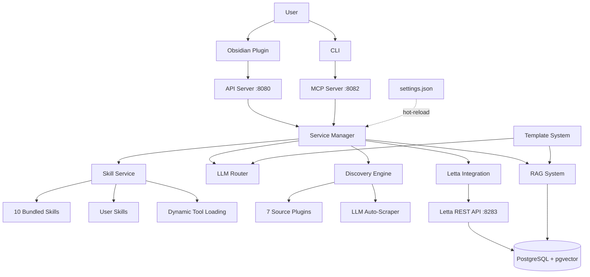

<p align="center">
  
</p>

# Thoth Research Assistant

An advanced AI-powered research assistant system built for flexibility, extensibility, and user control. Thoth combines intelligent automation with comprehensive customization — every prompt, schema, and source can be tailored to your workflow.

[](https://python.org)
[](https://github.com/acertainKnight/project-thoth/actions/workflows/ci.yml)
[](https://codecov.io/gh/acertainKnight/project-thoth)
[](https://github.com/acertainKnight/project-thoth/pkgs/container/project-thoth)
[](LICENSE)

[Quick Start](#quick-start) • [About](#about-this-project) • [Why Thoth?](#why-thoth) • [Architecture](#architecture) • [Features](#features) • [Documentation](#documentation)

---

## About This Project

### The Problem

As an AI practitioner juggling a full-time job while trying to stay current with rapid advancements in AI research, I found myself drowning in papers. Existing research tools were too rigid—they locked me into their workflow, their sources, their extraction schemas. I couldn't easily add new paper sources, customize what metadata got extracted, or control where my data lived.

But the real friction wasn't just the lack of customization—it was the **interface**. Research tools forced me to constantly hunt through settings files, create countless memory configurations, edit YAML configs, and manage dozens of rule files. Sure, I *could* edit these manually, but why should that be the only option?

### The Insight

**Users want a single integration point: natural language.**

They don't want to manage files—they want to say "find papers from this new source" and have it work. They want to say "change how citations are extracted" without hunting through config files. Advanced users should still *be able* to edit files manually, but most people just want to communicate naturally.

This insight drove a core architectural decision: **the agent should have access to everything a user can do manually**. Create research queries, change settings, build skills, integrate tools—all through conversation. One interface for everything.

### Why Letta?

After trying various agent frameworks, [Letta](https://www.letta.com/) (formerly MemGPT) was the first that *actually* remembered what mattered. Its self-editing memory architecture meant the agent retained context about me, my work, and my preferences across sessions—not through brittle prompt engineering, but through structured, persistent memory blocks.

Letta's flexibility and SDK customizability aligned perfectly with this project's ethos: **user control over everything**. It was designed to be extended, not to lock you into a single vendor's workflow.

### The Result

Thoth is a research assistant built for people who want both power and ease:
- **Natural language interface** for daily use (chat with the agent)
- **Full manual control** for customization (edit templates, schemas, configs)
- **Local-first** for privacy (your data stays on your machine)
- **Extensible** through standards (MCP tools, plugin sources, Jinja2 templates)
- **Persistent** through Letta (memory that actually works)

It's the tool I needed but couldn't find—so I built it.

---

## Why Thoth?

Most research assistants lock you into rigid workflows and opaque systems. **Thoth is different** — it's built on architectural principles that prioritize user control, extensibility, and transparency.

### 🔓 Fully Local & Privacy-First
- All processing happens on your machine (only external calls are LLM API requests)
- Your research data never leaves your system
- Works offline after initial setup
- Full control over data storage and access

### ⚙️ Completely Customizable
- **Every prompt is editable**: All LLM prompts are Jinja2 templates you can modify
- **Extraction schemas are user-defined**: Control what metadata gets extracted from papers
- **Plugin-based sources**: Add any academic source you need
- **MCP-native tools**: Integrate any MCP tools from the ecosystem
- **Template-driven extraction**: Customize analysis without touching code

### 🔥 Hot-Loading Skill System
- **Start minimal, expand on-demand**: Agents load only the skills they need
- **10 bundled skills** + unlimited user-created skills
- **Two-tier discovery**: Bundled defaults + vault overrides
- **Token-efficient**: Skills load their tools dynamically, keeping context small
- **Role-based bundles**: Pre-configured skill sets for specialized agents

### 🤖 Automated Source Discovery
- **LLM-powered scraper creation**: Give any URL, get a working article scraper
- **Zero configuration needed**: Playwright + LLM auto-detect article elements
- **Iterative refinement**: Fix selectors with natural language feedback
- **7 pre-built plugins**: ArXiv, Semantic Scholar, NeurIPS, ICML, OpenReview, ACL, Papers with Code

### 🧠 Letta-Powered Persistent Memory
- **Self-editing memory**: Agents can update their own context across sessions
- **6 memory blocks per agent**: Persona, human preferences, research context, loaded skills, planning, scratchpad
- **Cross-session continuity**: Conversations and knowledge persist indefinitely
- **Research-backed**: Built on the MemGPT architecture ([Letta documentation](https://docs.letta.com/))

### 💬 Chat as Configuration Interface
- **Natural language settings management**: Change anything through conversation
- **No file hunting**: Ask the agent to update research questions, sources, schemas
- **Two interfaces for everything**: CLI commands OR chat with the agent
- **Settings hot-reload**: Changes apply in ~2 seconds without restart (dev mode)

### 🔧 MCP-Native Tool System
- **64 built-in MCP tools** across 16 categories
- **Standard protocol**: Add any MCP tools from the ecosystem
- **Dynamic attachment**: Tools attach/detach based on active skills
- **Extensible by design**: Users can register custom tools

---

## Quick Start

### One-Command Installation

**Linux/Mac:**
```bash
curl -fsSL https://raw.githubusercontent.com/acertainKnight/project-thoth/main/install.sh | bash
```

**Windows (via WSL2):**
```powershell
# 1. Install WSL2 (one-time, requires restart)
wsl --install

# 2. Open Ubuntu terminal and run:
curl -fsSL https://raw.githubusercontent.com/acertainKnight/project-thoth/main/install.sh | bash
```

**What the installer does:**
1. Detects/installs Docker
2. Runs interactive setup wizard
3. Installs `thoth` command to your PATH
4. Optionally starts services immediately

**Time:** ~5 minutes • **Requirements:** Docker (auto-installed if missing)

### Daily Usage

```bash
thoth start    # Start services
thoth status   # Check status
thoth logs     # View logs
thoth stop     # Stop services
thoth update   # Update to latest version
```

### Development Setup

```bash
git clone https://github.com/acertainKnight/project-thoth.git
cd project-thoth

# Install dependencies (Python 3.12 required)
uv sync

# Set vault path
export OBSIDIAN_VAULT_PATH="/path/to/your/obsidian/vault"

# Start development environment (hot-reload enabled)
make dev
```

---

## Architecture

Thoth uses a modular, service-oriented architecture designed for extensibility and maintainability.



### Key Design Decisions

**Why Letta for Memory?**
- Self-editing memory through tool calls (agents update their own context)
- Persistent state across sessions with PostgreSQL+pgvector backend
- Research-backed architecture from the MemGPT paper
- Cross-session continuity without context window limits
- See [Letta's documentation on stateful agents](https://docs.letta.com/guides/agents/overview)

**Why MCP for Tools?**
- Industry-standard protocol for LLM-tool integration
- Hot-loading: tools attach/detach dynamically based on active skills
- Ecosystem compatibility: integrate any MCP tools
- Clean separation between tool definition and agent logic

**Why Plugin Architecture for Sources?**
- Open-ended: users can add any academic source
- LLM-powered auto-scraper creates plugins from URLs without code
- Source-specific optimizations (e.g., ArXiv-specific metadata parsing)
- Easy to extend without modifying core codebase

**Why Template-Driven Extraction?**
- Users can customize what data gets extracted without code changes
- Provider-specific prompt optimization (OpenAI vs Google vs Anthropic)
- Analysis schemas define extraction structure
- Jinja2 templates for all prompts = full transparency and control

**Why Hot-Loading Skills?**
- Agents start minimal, expand capabilities on-demand
- Reduces token usage (only load what's needed)
- Skill-specific tools attach dynamically via Letta API
- Two-tier system (bundled + vault) allows user customization without forking

---

## Features

### Intelligent Agent System
- **2 specialized agents**: Research Orchestrator (user-facing) + Research Analyst (deep analysis)
- **64 MCP tools** across 16 categories
- **6 memory blocks** per agent: persona, human preferences, research context, loaded skills, planning, scratchpad
- **Persistent conversations**: Letta-backed memory persists across sessions
- **Dynamic tool loading**: Skills attach their required tools automatically

### Skill System
- **10 bundled skills**: paper-discovery, deep-research, knowledge-base-qa, online-research, rag-administration, research-project-coordination, research-query-management, settings-management, custom-source-setup, onboarding
- **2 skill bundles**: orchestrator and discovery role-based configurations
- **User skills**: Create custom skills in your vault, override bundled ones
- **Hot-reload**: Modify vault skills without restarting services
- **Token-efficient loading**: Skills provide summaries, full content loads on-demand

### Research Discovery
- **7 source plugins**: ArXiv, Semantic Scholar, NeurIPS, ICML, OpenReview, ACL Anthology, Papers with Code
- **Automated scraper builder**: LLM + Playwright auto-detect article elements from any URL
- **Iterative refinement**: Natural language feedback improves scraper accuracy
- **Scheduled discovery**: Cron-like background discovery for staying up-to-date
- **Deduplication**: DOI/title/author matching prevents redundant downloads

### Document Processing
- **Multi-stage pipeline**: Text extraction → Metadata → Citations → Enrichment → Chunking → Tags → Notes
- **Customizable extraction**: Edit `templates/analysis_schema.json` to control what gets extracted
- **Semantic chunking**: Context-preserving text segmentation with LangChain
- **Citation analysis**: 6-stage resolution chain (Crossref → OpenAlex → ArXiv → Fuzzy Matcher → Validator → Decision Engine)
- **Obsidian note generation**: Template-based markdown notes from analyzed papers

### RAG & Hybrid Search
- **Hybrid retrieval**: Semantic (pgvector) + BM25 (tsvector) search with Reciprocal Rank Fusion
- **Reranking pipeline**: LLM-based (zero-cost via OpenRouter) or Cohere API for precision re-scoring
- **Document-aware chunking**: Two-stage markdown header + recursive splitting preserves paper structure
- **PostgreSQL+pgvector+tsvector backend**: Unified storage for vectors, full-text search, and metadata
- **Custom indexes**: Create domain-specific search indexes via MCP tools
- **Embedding model**: OpenAI text-embedding-3-small (configurable)
- **Automatic migrations**: Database schema upgrades applied seamlessly on startup
- **Advanced RAG tools**: Reindex, optimize search, create custom indexes

### Configuration & Extensibility
- **Single source of truth**: All settings in `vault/thoth/_thoth/settings.json`
- **Hot-reload**: Settings changes apply in ~2 seconds (dev mode)
- **Vault-centric**: Config, data, logs all under `_thoth/` in your Obsidian vault
- **Two edit interfaces**: Manual file edits OR natural language chat with agent
- **Template customization**: Edit prompts in `_thoth/prompts/` (google, openai, agent, etc.)

---

## Coming Features

Thoth is actively developed with several exciting features on the roadmap:

### Near-Term (In Progress)

**Intelligent Knowledge Graphs**
- 🔄 Automated causal knowledge graph extraction from papers
- 🔄 Graph-based memory augmentation for agents
- 🔄 Visual knowledge graph exploration
- 🔄 Relationship inference across research domains

**Learned Discovery & Ranking**
- 🔄 User rating system for discovered articles
- 🔄 Personalized research ranking (learns from your ratings)
- 🔄 Relevance model training on your preferences
- 🔄 Smart source selection based on query type

**Enhanced Workflows**
- 🔄 Additional specialized skills for common research tasks
- 🔄 More MCP tools for advanced operations
- 🔄 Workflow templates for literature reviews, paper writing
- 🔄 Research project management improvements

**Citation System Improvements**
- 🔄 Faster citation extraction and processing
- 🔄 Enhanced citation network analysis
- 🔄 Better citation matching accuracy
- 🔄 Parallel citation enrichment

**Multi-Project & Multi-User Support**
- 🔄 Multi-project workflows (manage multiple research projects)
- 🔄 Multi-folder support (organize across folder structures)
- 🔄 Multi-user support (team research with access controls)

**Local & Privacy-First Processing**
- 🔄 Local LLM integrations (Ollama, LM Studio, vLLM)
- 🔄 Non-API based OCR (local document processing)
- 🔄 Offline-capable workflows
- 🔄 Zero external API dependency mode

### Medium-Term

**Discovery Enhancements**
- 📋 Additional source plugins (IEEE, ACM, PubMed Central, bioRxiv)
- 📋 Cross-source deduplication improvements
- 📋 Smart source routing (agent picks best source for query)

**Agent Capabilities**
- 📋 Multi-agent collaboration (agents work together on complex tasks)
- 📋 Agent-to-agent delegation protocols
- 📋 Specialized agents (methodology reviewer, statistics validator)

**Mobile & Accessibility**
- 📋 Enhanced mobile web experience
- 📋 Better touch interface optimization
- 📋 Voice input for research queries

### Long-Term Vision

**Advanced Intelligence**
- 🎯 Research gap detection (find unexplored directions)
- 🎯 Methodology suggestions (recommend methods for your research)
- 🎯 Experiment design assistance
- 🎯 Automated literature review generation
- 🎯 Hypothesis generation from literature

**Integration Ecosystem**
- 🎯 Zotero/Mendeley import/export
- 🎯 LaTeX bibliography generation
- 🎯 Notion/Roam Research sync
- 🎯 Browser extension (capture papers from any site)
- 🎯 Reference manager integrations

**Multi-Modal Research**
- 🎯 Image and figure extraction from papers
- 🎯 Dataset discovery and linking
- 🎯 Code extraction and replication
- 🎯 Video lecture integration

**Advanced Analytics**
- 🎯 Research trend detection (identify emerging topics)
- 🎯 Citation impact prediction
- 🎯 Reading recommendations based on trajectory
- 🎯 Collaboration network analysis

### Want to Help?

These features are prioritized based on community feedback. If you have ideas or want to contribute:

- 💬 **Discuss**: [GitHub Discussions](https://github.com/acertainKnight/project-thoth/discussions)
- 🐛 **Request**: [Feature Requests](https://github.com/acertainKnight/project-thoth/issues/new?labels=enhancement)
- 🛠️ **Build**: [Contributing Guide](CONTRIBUTING.md)

**Legend**: 🔄 In Progress | 📋 Planned | 🎯 Long-term

---

## Installation

### Requirements
- **Python 3.12** (3.13 not yet supported)
- **Docker & Docker Compose** (for containerized deployment)
- **Obsidian** (for plugin integration, optional)

### Environment Variables

| Variable | Required | Purpose |
|----------|----------|---------|
| `OBSIDIAN_VAULT_PATH` | **Yes** | Path to your Obsidian vault root |
| `API_OPENAI_KEY` | **Yes** | Embeddings for Thoth RAG + Letta memory |
| `API_OPENROUTER_KEY` | **Yes** | Backend LLM for analysis, queries, and routing |
| `API_MISTRAL_KEY` | **Yes** | PDF OCR extraction (uses mistral-ocr-latest) |
| `API_COHERE_KEY` | No | Cohere Rerank API (higher quality reranking) |
| `API_SEMANTIC_SCHOLAR_KEY` | No | Semantic Scholar API key |

### Letta Setup

Thoth uses [Letta](https://www.letta.com/) for agent memory. Two options:

**Option 1: Letta Cloud (Easiest)**
- Hosted service with free tier
- Setup: `thoth letta setup` (interactive wizard)
- Full guide: [docs/letta-cloud-setup.md](docs/letta-cloud-setup.md)

**Option 2: Self-Hosted (Default)**
- Local Docker container
- Full control, works offline
- Auto-started by `make dev` or `docker compose -f docker-compose.letta.yml up -d`
- Full guide: [docs/letta-setup.md](docs/letta-setup.md)

---

## Usage

### CLI Commands

| Command | Purpose |
|---------|---------|
| `thoth setup` | Interactive setup wizard |
| `thoth server start` | Start API server |
| `thoth mcp start` | Start MCP server |
| `thoth discovery start` | Start discovery service |
| `thoth pdf monitor` | Monitor directory for PDFs |
| `thoth letta auth` | Manage Letta authentication |
| `thoth research ...` | Research operations |
| `thoth rag ...` | RAG operations |

See [docs/quick-reference.md](docs/quick-reference.md) for full command reference.

### Development Commands

| Command | Purpose |
|---------|---------|
| `make dev` | Start development environment (hot-reload enabled) |
| `make prod` | Start production server (optimized) |
| `make health` | Check all services health |
| `make dev-logs` | View development logs |
| `make deploy-plugin` | Deploy Obsidian plugin |

### Using the Agent

**Via Obsidian Plugin:**
1. Install plugin (auto-deployed by `make dev`)
2. Click Thoth icon in left sidebar
3. Chat with the Research Orchestrator

**Via Letta REST API:**
```bash
curl http://localhost:8283/v1/agents
```

**Via Python:**
```python
from thoth.services.letta_service import LettaService

letta = LettaService(config)
response = letta.send_message(
    agent_id="thoth_main_orchestrator",
    message="Find papers on transformer attention mechanisms"
)
```

---

## Configuration

### Directory Structure

All Thoth data lives in your Obsidian vault:

```
vault/
├── thoth/
│   ├── _thoth/                        # Internal workspace
│   │   ├── settings.json              # Main configuration (hot-reloadable)
│   │   ├── analysis_schema.json       # Customizable analysis schema (editable)
│   │   ├── mcps.json                  # External MCP server config
│   │   ├── templates/                 # Note & schema templates (populated by setup)
│   │   │   ├── obsidian_note.md       # Jinja2 template for generated notes
│   │   │   └── analysis_schema.json   # Default schema seed template
│   │   ├── prompts/                   # LLM prompt templates (populated by setup)
│   │   │   └── google/                # Provider-specific prompts
│   │   │       └── *.j2              # Jinja2 prompt files
│   │   ├── skills/                    # User-created skills
│   │   ├── data/                      # Runtime data
│   │   │   ├── output/               # Processing output & tracking
│   │   │   ├── knowledge/            # Knowledge base storage
│   │   │   ├── queries/              # Research queries
│   │   │   └── agent/                # Agent storage
│   │   ├── logs/                      # Application logs
│   │   └── cache/                     # Temporary cache files
│   ├── papers/
│   │   ├── pdfs/                      # Drop research PDFs here
│   │   └── markdown/                  # Converted markdown files
│   └── notes/                         # Generated Obsidian notes
│
└── .obsidian/plugins/thoth-obsidian/  # Obsidian plugin files
```

### Settings Hot-Reload

Changes to `settings.json` apply automatically in development mode (~2 seconds):

```bash
# Edit settings
vim vault/thoth/_thoth/settings.json

# Changes auto-detected and applied
# No restart needed!
```

---

## Development

### Project Structure

```
project-thoth/
├── src/thoth/                    # Python source code
│   ├── cli/                      # CLI interface (14 command modules)
│   ├── mcp/                      # MCP server + 64 tools
│   ├── services/                 # Business logic services
│   ├── discovery/                # Multi-source discovery engine
│   │   ├── plugins/              # 7 source plugins
│   │   └── browser/              # Auto-scraper (workflow_builder.py)
│   ├── server/                   # FastAPI REST API (13 routers)
│   ├── .skills/                  # 10 bundled skills + 2 bundles
│   ├── config.py                 # Unified configuration system (1564 lines)
│   └── initialization.py         # Factory function for Thoth setup
│
├── obsidian-plugin/              # TypeScript Obsidian plugin
├── templates/                    # Prompt templates + analysis schemas
│   ├── analysis_schema.json     # Extraction schema presets
│   ├── obsidian_note.md         # Note generation template
│   └── prompts/                  # Jinja2 prompt templates
│       ├── default/
│       ├── openai/
│       ├── google/
│       └── agent/
│
├── docker/                       # Service-specific Dockerfiles
│   ├── all-in-one/Dockerfile
│   ├── api/Dockerfile
│   ├── mcp/Dockerfile
│   └── pdf-monitor/Dockerfile
│
└── tests/                        # Test suite (90 test files)
```

### Testing

```bash
# Run all tests
pytest tests/

# Run with coverage
pytest --cov=src/thoth tests/

# Run specific test categories
pytest tests/unit/              # Unit tests
pytest tests/integration/       # Integration tests
```

### Code Quality

```bash
uv run ruff check             # Linting
uv run ruff format            # Auto-formatting
uv run ruff check --fix       # Auto-fix issues
```

---

## Documentation

### Core Documentation
- [Setup Guide](docs/setup.md) - Comprehensive setup instructions
- [Architecture](docs/architecture.md) - System architecture deep-dive
- [Design Philosophy](docs/design-philosophy.md) - Core principles and design decisions
- [Usage Guide](docs/usage.md) - Detailed usage examples
- [Quick Reference](docs/quick-reference.md) - Command cheat sheet

### Component Documentation
- [MCP Architecture](docs/mcp-architecture.md) - MCP server and tool system
- [Discovery System](docs/discovery-system.md) - Multi-source discovery
- [Document Pipeline](docs/document-pipeline.md) - PDF processing
- [RAG System](docs/rag-system.md) - Vector search and retrieval
- [Letta Integration](docs/letta-architecture.md) - Agent system and memory
- [Skills System](docs/skills-system.md) - Dynamic skill-loading system

### Setup & Deployment
- [Letta Setup](docs/letta-setup.md) - Self-hosted Letta configuration
- [Letta Cloud Setup](docs/letta-cloud-setup.md) - Cloud Letta configuration
- [Docker Deployment](docs/docker-deployment.md) - Container deployment guide
- [Testing Strategy](docs/testing-strategy.md) - Testing documentation

### Advanced
- [Customizable Analysis Schemas](docs/customizable-analysis-schemas.md) - Schema customization
- [MCP Configuration](docs/mcp-configuration.md) - Advanced MCP setup
- [Mobile Usage](docs/mobile-usage.md) - Using Thoth on mobile devices

---

## Contributing

Contributions welcome! See [CONTRIBUTING.md](CONTRIBUTING.md) for guidelines.

**Development Standards:**
- **Code Style**: Ruff formatting (PEP 8 compliant)
- **Type Hints**: Use for all public functions (Python 3.12+ syntax)
- **Documentation**: Google-style docstrings for all functions
- **Testing**: Write tests for new features
- **Commits**: Conventional commits (`feat:`, `fix:`, `docs:`, `chore:`)

---

## License

Apache License 2.0 - See [LICENSE](LICENSE) for details.

---

## Project Links

- **GitHub**: [github.com/acertainKnight/project-thoth](https://github.com/acertainKnight/project-thoth)
- **Issues**: [GitHub Issues](https://github.com/acertainKnight/project-thoth/issues)
- **CI/CD**: [GitHub Actions](https://github.com/acertainKnight/project-thoth/actions)

---

**Thoth Research Assistant** — Research tools that adapt to you, not the other way around.

*Built with Python 3.12, TypeScript, FastAPI, Letta, PostgreSQL+pgvector, and Obsidian.*
