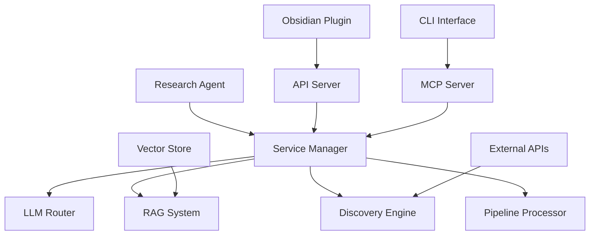

# Thoth Research Assistant

An advanced AI-powered research assistant system designed for academic research paper processing, knowledge management, and intelligent document analysis. Thoth combines a powerful Python backend with an Obsidian plugin for seamless integration into research workflows.

[](https://python.org)
[](LICENSE)
[](CONTRIBUTING.md)

[Quick Start](#quick-start) • [Installation](#installation) • [Usage](#usage-examples) • [Contributing](#contributing)

## Why Thoth?

Thoth revolutionizes academic research by combining cutting-edge AI with intuitive knowledge management. Whether you're a researcher managing hundreds of papers, a student building literature reviews, or an academic seeking insights from document collections, Thoth provides intelligent automation for your research workflow.

**Key Benefits:**
- **Faster Analysis**: AI-powered paper summarization and analysis
- **Smart Integration**: Native Obsidian plugin with real-time sync
- **Multi-Source Discovery**: Automated paper discovery from ArXiv, Semantic Scholar, and more
- **Persistent Memory**: Advanced agent system with cross-session memory

## Table of Contents

- [Quick Start](#quick-start)
- [Installation](#installation)
- [Key Features](#key-features)
- [Architecture](#architecture)
- [Usage Examples](#usage-examples)
- [Configuration](#configuration)
- [Development](#development)
- [Contributing](#contributing)
- [License](#license)

## Quick Start

```bash
# Clone and setup
git clone https://github.com/acertainKnight/project-thoth.git
cd project-thoth

# Install dependencies (requires Python 3.10+)
uv venv && uv sync

# Configure API keys
echo "MISTRAL_API_KEY=your_key_here" > .env
echo "OPENROUTER_API_KEY=your_key_here" >> .env

# Launch Thoth
make dev  # Starts both API server and plugin watcher
```

Visit `http://localhost:8000` to verify the API server is running.

### Docker Deployment

For containerized deployment:

```bash
# Development
make docker-init     # Initialize Docker environment
cp .env.docker.example .env.docker
make docker-dev      # Start development services

# Production
cp .env.prod.example .env.prod
make docker-prod     # Deploy production services
```

Services will be available at:
- API Server: http://localhost:8000
- MCP Server: http://localhost:8001
- ChromaDB: http://localhost:8003

## Key Features

### Advanced AI System
- **LangGraph-Powered Agents**: Modern agentic workflows with tool orchestration
- **Multi-Provider LLM Router**: Intelligent routing across OpenAI, Anthropic, Mistral, OpenRouter
- **Persistent Memory**: Letta-based memory system with salience-based retention
- **MCP Framework**: Full Model Context Protocol support for agent interoperability

### Document Processing
- **Multi-Stage Pipelines**: Configurable processing with extensible stages
- **Citation Analysis**: Advanced extraction with network analysis capabilities
- **Semantic Chunking**: Context-preserving intelligent text segmentation
- **Metadata Enrichment**: Automated extraction of academic metadata and relationships

### Research Discovery
- **Multi-Source Integration**: ArXiv, Semantic Scholar, and web search
- **Chrome Extension Bridge**: Real-time paper collection from browser
- **Automated Scheduling**: Background discovery with configurable intervals
- **Source Evaluation**: Pre-download relevance scoring and filtering

## Architecture

Thoth uses a service-oriented architecture with the `ServiceManager` as the central orchestrator:



### Core Components

**Python Backend** (`src/thoth/`)
- **Service Architecture**: Microservice-based with centralized ServiceManager
- **Pipeline System**: Modular, extensible document processing stages
- **Agent System**: LangGraph-powered with persistent memory
- **API Layer**: FastAPI server with REST + WebSocket support
- **MCP Integration**: Full Model Context Protocol implementation
- **CLI Tools**: Comprehensive command-line interface

**Obsidian Plugin** (`obsidian-plugin/thoth-obsidian/`)
- **Multi-Chat Interface**: Concurrent research conversations
- **Real-time Sync**: Live WebSocket connection to backend
- **Settings Panel**: Complete configuration management
- **Note Integration**: Direct interaction with vault files
- **Auto-updates**: Hot reload during development

**Technology Stack**: Python, FastAPI, LangGraph, TypeScript, Obsidian, ChromaDB

## Installation

### Prerequisites
- Python 3.10-3.12
- Obsidian (for plugin integration)
- uv (recommended) or pip

### Quick Installation

```bash
# Clone repository
git clone https://github.com/acertainKnight/project-thoth.git
cd project-thoth

# Install with uv (recommended)
uv venv && uv sync

# Or with pip
python -m venv .venv
source .venv/bin/activate  # Windows: .venv\Scripts\activate
pip install -e .

# Configure API keys
echo "MISTRAL_API_KEY=your_key_here" > .env
echo "OPENROUTER_API_KEY=your_key_here" >> .env

# Deploy to Obsidian and start services
make dev
```

### API Keys

| Service | Required | Purpose |
|---------|----------|---------|
| Mistral | Yes | Primary LLM provider |
| OpenRouter | Yes | LLM fallback |
| OpenAI | No | Alternative LLM |
| Semantic Scholar | No | Paper discovery |

Get keys from: [Mistral Console](https://console.mistral.ai/), [OpenRouter](https://openrouter.ai/keys)

## Usage Examples

### Interactive Research Session
```bash
# Start the research agent
python -m thoth agent

# Start with specific research focus
python -m thoth agent research --query "transformer architectures"
```

### Document Processing
```bash
# Process single PDF
python -m thoth pdf process /path/to/paper.pdf

# Batch process directory
python -m thoth pdf process /path/to/papers/ --parallel

# Monitor directory with real-time processing
python -m thoth monitor --watch-dir ./papers --optimized
```

### Multi-Source Discovery
```bash
# Start discovery service
python -m thoth discovery start

# Search specific sources
python -m thoth discovery search "large language models" --source arxiv
python -m thoth discovery search "neural networks" --source semantic_scholar
```

### Development Commands

| Command | Purpose |
|---------|---------|
| `make dev` | Full development environment |
| `make start-api` | API server only |
| `make deploy-plugin` | Deploy to Obsidian |
| `make status` | Check service health |
| `make clean` | Clean build artifacts |

## Configuration

### Environment Variables

| Category | Variable | Purpose | Required |
|----------|----------|---------|----------|
| AI | `MISTRAL_API_KEY` | Primary LLM provider | Yes |
| AI | `OPENROUTER_API_KEY` | LLM fallback/alternatives | Yes |
| AI | `OPENAI_API_KEY` | OpenAI models | No |
| Discovery | `SEMANTIC_SCHOLAR_KEY` | Academic paper metadata | No |
| Discovery | `GOOGLE_API_KEY` | Web search capabilities | No |
| Data | `OPENCITATIONS_KEY` | Citation data access | No |
| System | `THOTH_WORKSPACE_DIR` | Main working directory | No |
| System | `THOTH_PDF_DIR` | PDF storage location | No |

### Directory Structure
```
workspace/
├── pdfs/              # Original PDF documents
├── data/              # Processed documents and embeddings
├── knowledge/         # Knowledge graphs and citations
├── logs/              # Application logs
└── config/            # User configuration files
```

## Development

### Project Structure
```
project-thoth/
├── src/thoth/              # Python package
│   ├── cli/               # Command-line interface
│   ├── services/          # Core services
│   ├── mcp/              # MCP protocol implementation
│   ├── server/           # API server
│   ├── pipelines/        # Document processing
│   ├── rag/              # RAG implementation
│   └── utilities/        # Helper modules
├── obsidian-plugin/       # Obsidian integration
│   └── thoth-obsidian/   # Plugin source code
├── Makefile              # Development commands
└── pyproject.toml        # Python project configuration
```

### Testing
```bash
# Run all tests
pytest tests/

# Run with coverage
pytest --cov=src/thoth tests/

# Run specific test categories
pytest tests/services/            # Service layer tests
pytest tests/agent_v2/            # Agent system tests
pytest tests/integration/         # Integration tests
```

### Code Quality
```bash
# Linting and formatting
uv run ruff check            # Check code quality
uv run ruff format           # Format code
uv run pytest               # Run tests
```

### Quick Contribution Guide

1. Fork the repository
2. Create a feature branch: `git checkout -b feature/amazing-feature`
3. Make your changes following our style guide
4. Test your changes: `pytest tests/`
5. Commit your changes: `git commit -m "Add amazing feature"`
6. Push to your branch: `git push origin feature/amazing-feature`
7. Open a Pull Request

## Advanced Features

### Multi-Agent Intelligence
- **Specialized Research Agents**: Dedicated agents for literature review, citation analysis, and concept extraction
- **Agent Orchestration**: Intelligent coordination between agents for complex research workflows
- **Memory Sharing**: Cross-agent knowledge sharing for comprehensive analysis

### Knowledge Graph Integration
- **Automatic Relationship Extraction**: AI-powered discovery of connections between papers and concepts
- **Visual Knowledge Mapping**: Interactive graph visualization of research relationships
- **Graph-Based Queries**: Semantic search through connected knowledge structures

### Performance & Scale
- **Async Processing**: Concurrent operations for handling multiple documents simultaneously
- **Smart Caching**: Intelligent caching of embeddings, analysis results, and API responses
- **Memory Management**: Efficient handling of large document collections and knowledge bases

## License

Apache License 2.0 - See [LICENSE](LICENSE) file for details.

---

**Thoth** - Empowering research through intelligent automation and AI-assisted knowledge management.
