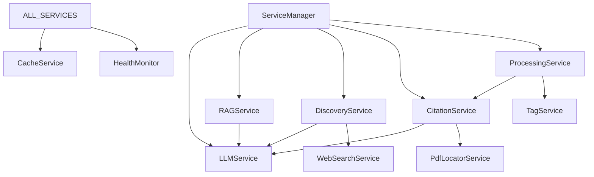

# Thoth Services Documentation

This document provides detailed information about the service-oriented architecture of Thoth, including individual service responsibilities, APIs, and integration patterns.

## Service Architecture Overview

Thoth uses a microservice-like architecture where each service handles a specific domain of functionality. All services are coordinated through the `ServiceManager` and follow consistent patterns for health monitoring, configuration, and error handling.

## Core Services

### 1. LLM Service (`src/thoth/services/llm_service.py`)

Manages language model interactions with multiple provider support.

**Responsibilities:**
- LLM provider abstraction and routing
- Token usage tracking and optimization
- Model selection based on task requirements
- Response caching and rate limiting

**Key Methods:**
```python
class LLMService:
    async def generate_response(self, prompt: str, model: str = None, **kwargs) -> str
    async def analyze_document(self, content: str, analysis_type: str) -> AnalysisResponse
    async def extract_structured_data(self, text: str, schema: Type[BaseModel]) -> BaseModel
    def get_available_models(self) -> List[str]
    def get_token_usage(self, time_period: str = "24h") -> Dict[str, int]
```

### 2. LLM Router (`src/thoth/services/llm_router.py`)

Intelligent routing of LLM requests to optimal providers.

**Routing Strategy:**
- **Analysis Tasks**: Route to Anthropic Claude for better reasoning
- **Generation Tasks**: Route to OpenAI GPT-4 for creative output
- **Code Tasks**: Route to specialized models via OpenRouter
- **Bulk Processing**: Route to cost-effective models (Mistral)

**Configuration:**
```python
routing_config = {
    "analysis": {"provider": "anthropic", "model": "claude-3-sonnet"},
    "generation": {"provider": "openai", "model": "gpt-4"},
    "summarization": {"provider": "mistral", "model": "mistral-large"},
    "code": {"provider": "openrouter", "model": "codellama-34b"}
}
```

### 3. RAG Service (`src/thoth/services/rag_service.py`)

Manages retrieval-augmented generation and vector search.

**Responsibilities:**
- Vector database management (ChromaDB)
- Document embedding and indexing
- Semantic search and retrieval
- Context assembly for LLM queries

**Key Methods:**
```python
class RAGService:
    async def add_documents(self, documents: List[Document]) -> None
    async def search(self, query: str, top_k: int = 10, filters: Dict = None) -> List[SearchResult]
    async def generate_with_context(self, query: str, max_context: int = 8000) -> str
    async def reindex_collection(self, collection_name: str) -> None
    def get_collection_stats(self, collection_name: str) -> Dict[str, Any]
```

**Collections Structure:**
- `papers_full`: Complete paper content with metadata
- `papers_abstracts`: Abstract-only collection for quick searches
- `citations`: Citation text and metadata
- `figures`: Figure captions and descriptions

### 4. Discovery Service (`src/thoth/services/discovery_service.py`)

Automated research paper discovery from multiple sources.

**Supported Sources:**
- ArXiv (academic preprints)
- Semantic Scholar (peer-reviewed papers)
- Google Scholar (via web scraping)
- Chrome Extension (user-browsed papers)
- RSS Feeds (journal updates)

**Key Methods:**
```python
class DiscoveryService:
    async def create_source(self, config: DiscoverySourceConfig) -> str
    async def run_discovery(self, source_id: str) -> DiscoveryResult
    async def schedule_discovery(self, source_id: str, interval: int) -> None
    def list_sources(self) -> List[DiscoverySource]
    async def evaluate_papers(self, papers: List[Paper], query: ResearchQuery) -> List[EvaluationResult]
```

### 5. Citation Service (`src/thoth/services/citation_service.py`)

Citation extraction, validation, and network analysis.

**Features:**
- Advanced citation parsing with multiple formats
- Citation validation against academic databases
- Citation network construction and analysis
- Cross-reference resolution

**Key Methods:**
```python
class CitationService:
    async def extract_citations(self, document: Document) -> List[Citation]
    async def validate_citations(self, citations: List[Citation]) -> List[ValidatedCitation]
    async def build_citation_network(self, papers: List[Paper]) -> CitationNetwork
    async def find_citation_paths(self, source_paper: str, target_paper: str) -> List[Path]
    def get_citation_metrics(self, paper_id: str) -> CitationMetrics
```

### 6. Processing Service (`src/thoth/services/processing_service.py`)

Document processing and content extraction.

**Pipeline Stages:**
1. **Text Extraction**: PDF to text conversion with OCR fallback
2. **Metadata Extraction**: Title, authors, publication info, DOI
3. **Citation Processing**: Bibliography and in-text reference extraction
4. **Content Analysis**: Section identification and structural parsing
5. **Figure Processing**: Caption extraction and image analysis
6. **Quality Assessment**: Confidence scoring and error detection

**Key Methods:**
```python
class ProcessingService:
    async def process_document(self, file_path: str, options: ProcessingOptions) -> ProcessedDocument
    async def extract_text(self, pdf_path: str) -> TextExtractionResult
    async def extract_metadata(self, content: str) -> DocumentMetadata
    def get_processing_status(self, job_id: str) -> ProcessingStatus
    async def batch_process(self, file_paths: List[str], batch_size: int = 10) -> List[ProcessingResult]
```

### 7. Query Service (`src/thoth/services/query_service.py`)

Research query management and evaluation.

**Query Types:**
- **Inclusion Queries**: Define what papers to include
- **Exclusion Queries**: Define what papers to exclude
- **Evaluation Queries**: Assess paper relevance
- **Discovery Queries**: Guide automated paper discovery

**Key Methods:**
```python
class QueryService:
    def create_query(self, config: QueryConfig) -> str
    def update_query(self, query_id: str, updates: Dict[str, Any]) -> None
    async def evaluate_paper(self, paper: Paper, query_id: str) -> EvaluationResult
    async def evaluate_query_performance(self, query_id: str, test_papers: List[Paper]) -> PerformanceMetrics
    def list_queries(self, filters: Dict[str, Any] = None) -> List[ResearchQuery]
```

### 8. Tag Service (`src/thoth/services/tag_service.py`)

Automated tagging and taxonomy management.

**Features:**
- AI-powered tag generation
- Tag hierarchy construction
- Tag consolidation and deduplication
- Custom taxonomy support

**Key Methods:**
```python
class TagService:
    async def generate_tags(self, document: Document, max_tags: int = 10) -> List[str]
    async def consolidate_tags(self, tags: List[str]) -> ConsolidatedTagsResponse
    def create_tag_hierarchy(self, tags: List[str]) -> TagHierarchy
    async def suggest_tags(self, content: str, existing_tags: List[str]) -> List[str]
    def get_tag_statistics(self) -> Dict[str, int]
```

## Specialized Services

### 9. Article Service (`src/thoth/services/article_service.py`)

Article-specific operations and metadata management.

**Responsibilities:**
- Article lifecycle management
- Metadata enrichment and validation
- Version tracking and updates
- Cross-reference management

### 10. Note Service (`src/thoth/services/note_service.py`)

Integration with note-taking systems and knowledge management.

**Features:**
- Obsidian note integration
- Markdown processing and linking
- Note-to-paper relationship tracking
- Automated note generation from papers

### 11. Web Search Service (`src/thoth/services/web_search_service.py`)

Web search integration for broader research coverage.

**Supported Providers:**
- Google Custom Search
- Serper API
- DuckDuckGo
- Bing Academic Search

### 12. Cache Service (`src/thoth/services/cache_service.py`)

Multi-level caching for performance optimization.

**Cache Levels:**
- **Memory Cache**: Fast access for frequently used data
- **Redis Cache**: Shared cache across service instances
- **Disk Cache**: Persistent cache for large objects
- **API Response Cache**: Cached external API responses

### 13. Async Processing Service (`src/thoth/services/async_processing_service.py`)

Background task processing and queue management.

**Task Types:**
- Document processing jobs
- Discovery tasks
- Citation analysis
- Knowledge graph updates
- Bulk operations

## Service Integration Patterns

### 1. Service Discovery and Registration

Services register themselves with the ServiceManager:

```python
class ServiceManager:
    def __init__(self):
        self.services = {}
        self._register_core_services()
        self._register_specialized_services()
        self._setup_service_dependencies()

    def register_service(self, name: str, service: BaseService):
        self.services[name] = service
        service.set_service_manager(self)
```

### 2. Inter-Service Communication

Services communicate through the ServiceManager:

```python
class BaseService:
    def __init__(self, service_manager: ServiceManager):
        self.service_manager = service_manager

    def get_service(self, service_name: str):
        return self.service_manager.get_service(service_name)
```

### 3. Health Monitoring

All services implement health check interfaces:

```python
class BaseService:
    def health_check(self) -> Dict[str, Any]:
        return {
            "service": self.__class__.__name__,
            "status": "healthy",
            "timestamp": datetime.now().isoformat(),
            "metrics": self.get_metrics()
        }
```

### 4. Configuration Management

Services use centralized configuration:

```python
class BaseService:
    def __init__(self, config: ServiceConfig):
        self.config = config
        self.logger = self._setup_logger()
        self._validate_config()
```

## Service Dependencies



## Service Configuration

### Environment Variables

Services are configured through environment variables:

```bash
# LLM Service
THOTH_LLM_PRIMARY_PROVIDER=anthropic
THOTH_LLM_FALLBACK_PROVIDER=openrouter
THOTH_LLM_MAX_TOKENS=4096
THOTH_LLM_TEMPERATURE=0.7

# RAG Service
THOTH_RAG_EMBEDDING_MODEL=sentence-transformers/all-mpnet-base-v2
THOTH_RAG_CHUNK_SIZE=512
THOTH_RAG_CHUNK_OVERLAP=50
THOTH_RAG_COLLECTION_NAME=thoth_papers

# Discovery Service
THOTH_DISCOVERY_MAX_CONCURRENT=5
THOTH_DISCOVERY_RATE_LIMIT=1.0
THOTH_DISCOVERY_CACHE_TTL=3600

# Processing Service
THOTH_PROCESSING_MAX_WORKERS=4
THOTH_PROCESSING_TIMEOUT=300
THOTH_PROCESSING_TEMP_DIR=/tmp/thoth
```

### Service-Specific Configuration Files

Each service can have its own configuration file:

```yaml
# config/llm_service.yml
providers:
  anthropic:
    models: ["claude-3-sonnet", "claude-3-haiku"]
    rate_limits:
      requests_per_minute: 50
      tokens_per_minute: 40000

  openai:
    models: ["gpt-4", "gpt-3.5-turbo"]
    rate_limits:
      requests_per_minute: 60
      tokens_per_minute: 90000

routing_rules:
  - task_type: "analysis"
    preferred_provider: "anthropic"
    fallback_provider: "openai"

  - task_type: "generation"
    preferred_provider: "openai"
    fallback_provider: "anthropic"
```

## Performance and Monitoring

### Service Metrics

Each service exposes metrics for monitoring:

```python
class ServiceMetrics:
    def __init__(self):
        self.request_count = Counter('service_requests_total')
        self.response_time = Histogram('service_response_time_seconds')
        self.error_count = Counter('service_errors_total')
        self.active_connections = Gauge('service_active_connections')
```

### Resource Management

Services implement resource management:

```python
class BaseService:
    def __init__(self):
        self.resource_manager = ResourceManager()
        self.connection_pool = ConnectionPool(max_connections=10)

    async def __aenter__(self):
        await self.connection_pool.initialize()
        return self

    async def __aexit__(self, exc_type, exc_val, exc_tb):
        await self.connection_pool.cleanup()
```

### Load Balancing

Services support horizontal scaling:

```python
class ServiceRegistry:
    def __init__(self):
        self.service_instances = defaultdict(list)

    def register_instance(self, service_name: str, instance: ServiceInstance):
        self.service_instances[service_name].append(instance)

    def get_service_instance(self, service_name: str) -> ServiceInstance:
        instances = self.service_instances[service_name]
        return self.load_balancer.select_instance(instances)
```

## Error Handling and Resilience

### Circuit Breaker Pattern

Services implement circuit breakers for external dependencies:

```python
class ServiceWithCircuitBreaker:
    def __init__(self):
        self.circuit_breaker = CircuitBreaker(
            failure_threshold=5,
            recovery_timeout=60,
            expected_exception=ExternalServiceError
        )

    @circuit_breaker
    async def call_external_service(self, request):
        return await external_api.call(request)
```

### Retry Logic

Automatic retry for transient failures:

```python
@retry(
    stop=stop_after_attempt(3),
    wait=wait_exponential(multiplier=1, min=4, max=10),
    retry=retry_if_exception_type(TransientError)
)
async def resilient_service_call(self, request):
    return await self.make_request(request)
```

### Graceful Degradation

Services degrade gracefully when dependencies are unavailable:

```python
async def get_enhanced_results(self, query: str):
    try:
        enhanced_data = await self.enhancement_service.enhance(query)
        return self.combine_results(base_results, enhanced_data)
    except ServiceUnavailableError:
        logger.warning("Enhancement service unavailable, returning basic results")
        return base_results
```

## Development and Testing

### Service Testing

Each service includes comprehensive tests:

```python
# tests/services/test_llm_service.py
class TestLLMService:
    async def test_generate_response(self):
        service = LLMService(mock_config)
        response = await service.generate_response("Test prompt")
        assert response is not None
        assert len(response) > 0

    async def test_token_usage_tracking(self):
        service = LLMService(mock_config)
        await service.generate_response("Test prompt")
        usage = service.get_token_usage()
        assert usage["total_tokens"] > 0
```

### Service Mocking

Mock services for testing:

```python
class MockLLMService(LLMService):
    async def generate_response(self, prompt: str, **kwargs) -> str:
        return f"Mock response for: {prompt[:50]}..."

    def get_token_usage(self) -> Dict[str, int]:
        return {"total_tokens": 100, "prompt_tokens": 50, "completion_tokens": 50}
```

---

This service architecture provides a robust, scalable foundation for the Thoth research assistant system while maintaining clear separation of concerns and enabling independent development and deployment of individual services.
