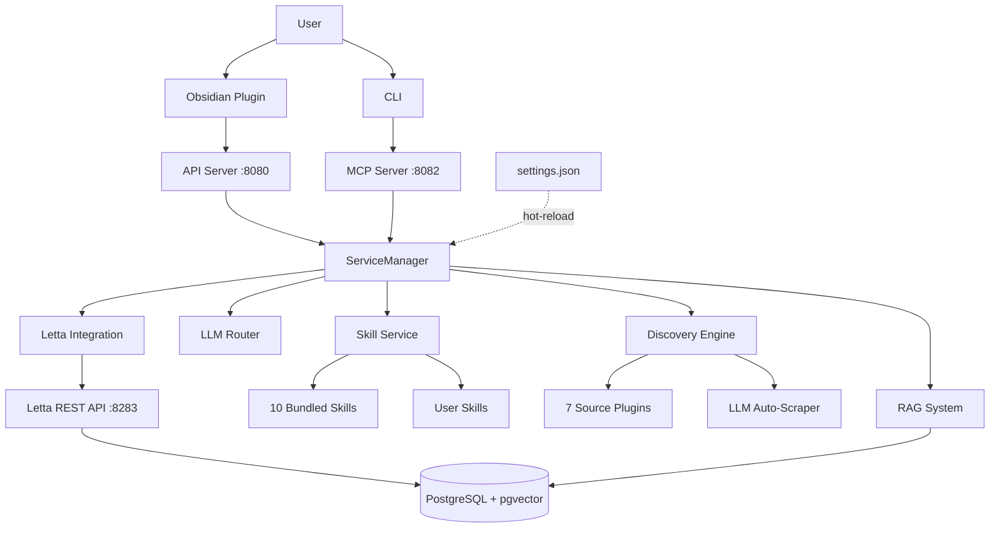

# Thoth Architecture

Technical documentation for the Thoth Research Assistant architecture.

## Table of Contents

- [System Overview](#system-overview)
- [Core Services](#core-services)
- [Skill System](#skill-system)
- [Agent Architecture](#agent-architecture)
- [MCP Tool System](#mcp-tool-system)
- [Discovery Engine](#discovery-engine)
- [Document Processing](#document-processing)
- [Data Storage](#data-storage)
- [Configuration System](#configuration-system)
- [Deployment Architecture](#deployment-architecture)

---

## System Overview

Thoth uses a modular, service-oriented architecture designed for extensibility and maintainability. The system is built around **independent services** communicating through well-defined interfaces.

### High-Level Architecture



### Design Principles

1. **Independent Services**: Letta and Thoth run as separate services - restarting Thoth never affects agent memory
2. **Vault-Centric**: Single source of truth in `settings.json`
3. **Hot-Reload**: Configuration changes apply in ~2 seconds (dev mode)
4. **Skill-Based**: On-demand tool loading for token efficiency
5. **Type-Safe**: Pydantic models throughout
6. **Extensible**: Plugin architecture for sources, skills, and tools

---

## Core Services

### Service Manager

**Location**: `src/thoth/services/service_manager.py` (257 lines)

Central coordinator for all Thoth services implementing dependency injection pattern.

**Initialization Phases**:
1. **Phase 1**: Core services (LLMService, ArticleService)
2. **Phase 2**: Path-dependent services (QueryService, DiscoveryService)
3. **Phase 3**: External APIs (LettaService - optional)
4. **Phase 4**: Advanced services (CitationService, PostgresService)
5. **Phase 5**: Discovery orchestration

**Key Services**:
- `LLMService`: Multi-provider LLM routing (Mistral, OpenRouter, OpenAI, Anthropic)
- `ArticleService`: Article management and operations
- `DiscoveryService`: Multi-source paper discovery
- `RAGService`: Hybrid search (semantic + BM25) with reranking (optional, requires extras)
- `PostgresService`: Database operations
- `CitationService`: Citation analysis and enrichment
- `SkillService`: Skill discovery and management
- `NoteService`: Obsidian note generation

### Initialization Factory

**Location**: `src/thoth/initialization.py` (103 lines)

Factory function `initialize_thoth()` performs complete initialization:

```python
services, pipeline, citation_graph = initialize_thoth()
```

1. Loads configuration from vault
2. Creates and initializes ServiceManager
3. Creates PDFTracker
4. Creates CitationGraph
5. Creates OptimizedDocumentPipeline
6. Runs automatic path migration (for synced data)

---

## Skill System

**Locations**:
- Service: `src/thoth/services/skill_service.py` (533 lines)
- Bundled skills: `src/thoth/.skills/` (10 skills)
- User skills: `vault/thoth/_thoth/skills/` (hot-reloadable)

### Two-Tier Discovery

1. **Bundled Skills** (shipped with Thoth):
   - `paper-discovery`: Find and curate research papers
   - `deep-research`: In-depth literature analysis
   - `knowledge-base-qa`: Answer questions from existing collection
   - `online-research`: Web-based research queries
   - `rag-administration`: Advanced RAG management
   - `research-project-coordination`: Multi-phase project management
   - `research-query-management`: Set up automated recurring searches
   - `settings-management`: Configure Thoth through chat
   - `custom-source-setup`: Create custom article sources
   - `onboarding`: Initialize new users

2. **Vault Skills** (user-specific):
   - Stored in `vault/thoth/_thoth/skills/`
   - Override bundled skills with same name
   - Hot-reload without restart

### Skill Format

Each skill is a `SKILL.md` file with YAML frontmatter:

```yaml
---
name: Skill Name
description: What this skill does
tools:
  - tool_name_1
  - tool_name_2
---

# Skill guidance content
...
```

### Dynamic Tool Loading

1. Agent calls `load_skill(skill_ids=["skill-name"], agent_id="...")`
2. Skill service parses skill YAML frontmatter
3. Required tools are attached to agent via Letta API
4. Agent follows skill guidance to complete task

**Benefits**:
- Agents start minimal (only 3-4 core tools)
- Skills load their tools dynamically
- Reduces token usage
- Improves LLM performance with smaller context

---

## Agent Architecture

### Two-Agent System

Thoth uses a specialized 2-agent architecture with persistent memory:

#### 1. Research Orchestrator (`thoth_main_orchestrator`)
**Role**: User-facing coordinator

**Core Tools** (minimal, expands via skills):
- `list_skills`
- `load_skill`
- `unload_skill`
- `search_articles`

**Memory Blocks** (6 total):
- `persona` (500 tokens): Core identity and role
- `human` (2000 tokens): User preferences and context
- `research_context` (3000 tokens): Active research projects
- `loaded_skills` (1000 tokens): Currently loaded capabilities
- `planning` (2000 tokens): Multi-step task plans
- `scratchpad` (2000 tokens): Working memory

#### 2. Research Analyst (`thoth_research_analyst`)
**Role**: Deep analysis specialist

**Tools** (analysis-focused):
- `answer_research_question`
- `explore_citation_network`
- `compare_articles`
- `evaluate_article`
- `find_related_papers`
- `get_citation_context`
- Plus all search and skill loading tools

**Memory Blocks** (6 total):
- `persona` (500 tokens): Analysis specialist identity
- `analysis_criteria` (1000 tokens): Evaluation standards
- `paper_summaries` (3000 tokens): Recently analyzed papers
- `methodology_notes` (2000 tokens): Methods and approaches
- `planning` (2000 tokens): Analysis plans
- `scratchpad` (2000 tokens): Working memory

### Memory Persistence

**Powered by Letta + PostgreSQL+pgvector**:
- Self-editing memory through tool calls
- Cross-session continuity
- Vector similarity search for relevant context
- Persistent conversations
- See [Letta Documentation](https://docs.letta.com/) for details

**Location**: `src/thoth/services/agent_initialization_service.py` (523 lines)

Agents are auto-created/updated on startup:
- Creates agents if missing
- Updates tools/persona if changed
- **Preserves memory and conversations** during updates
- Attaches filesystem folders for vault access

---

## MCP Tool System

**Locations**:
- Server: `src/thoth/mcp/server.py` (467 lines)
- Tools: `src/thoth/mcp/tools/` (20+ tool modules)
- Registry: `src/thoth/mcp/tools/__init__.py`

### 64 Active MCP Tools

Organized across 16 categories:

1. **Research Questions**: Create, list, update, delete, run discovery
2. **Article Management**: Search, list, update metadata
3. **Analysis Tools**: Answer questions, compare papers, evaluate quality
4. **Citation Tools**: Format citations, export bibliography, explore networks
5. **PDF Tools**: Download, locate PDFs
6. **Tag Management**: Consolidate tags, manage vocabulary
7. **Data Management**: Generate reading lists, sync with Obsidian
8. **Advanced RAG**: Reindex, optimize search, custom indexes
9. **Schema Management**: List presets, set preset, validate schemas
10. **Settings Management**: View, update, validate, migrate, reset
11. **Skill Management**: List, load, unload skills
12. **Workflow Builder**: Analyze source URLs, refine selectors, confirm workflows
13. **Discovery**: List available sources, run discovery
14. **Processing**: Get article details, collection stats
15. **Reading**: Read full article content
16. **Task Status**: Get async task status

**Tool Registration**:
- All tools inherit from `MCPTool` base class
- Auto-registration via `MCP_TOOL_CLASSES` list
- Dynamic attachment/detachment based on loaded skills

### MCP Protocol

**Transports**:
- HTTP (port 8082 external, 8000 internal): `/mcp` POST endpoint + `/sse` streaming
- JSON-RPC protocol for requests/responses
- Server-Sent Events for streaming responses

**Features**:
- Parameter validation with Pydantic
- Structured output schemas
- Error handling and recovery
- 3rd-party plugin support (via plugin_manager.py)

---

## Discovery Engine

**Location**: `src/thoth/discovery/`

### Source Plugins (7 built-in)

Plugin-based architecture allows easy addition of sources:

1. **ArXiv** (`arxiv_plugin.py`): RSS + API search
2. **Semantic Scholar** (`semantic_scholar_plugin.py`): Academic search API
3. **NeurIPS** (`neurips_plugin.py`): Conference proceedings
4. **ICML** (`icml_plugin.py`): Conference proceedings
5. **OpenReview** (`openreview_plugin.py`): ICLR and other venues
6. **ACL Anthology** (`acl_anthology_plugin.py`): NLP conferences
7. **Papers with Code** (`paperswithcode_plugin.py`): ML papers with code

**Plugin Interface**:
```python
class DiscoveryPlugin:
    def discover(self, query: str, max_results: int) -> list[Paper]:
        """Discover papers matching query."""
        pass
```

### Automated Scraper Builder

**Location**: `src/thoth/discovery/browser/workflow_builder.py` (949 lines)

LLM-powered auto-detection of article elements on any webpage:

**Flow**:
1. User provides URL
2. Playwright loads page and extracts simplified DOM
3. LLM analyzes structure and proposes CSS selectors
4. Selectors tested against live page
5. Sample results returned for user confirmation
6. User feedback → LLM refinement (iterative)
7. Confirmed selectors saved as workflow

**Key Components**:
- `_extract_dom_js`: JavaScript for simplified DOM extraction
- `_llm_analyze_page`: Structured LLM analysis with Pydantic schemas
- `_test_selectors`: Validate proposed selectors on live page
- `refine_selectors`: Iterative improvement based on feedback

**Pydantic Schemas**:
- `ProposedSelector`: CSS selector for a metadata field
- `SearchFilterInfo`: Detected search/filter UI element
- `PageAnalysisResult`: Complete analysis output
- `SelectorRefinement`: Refined selectors after feedback

---

## Document Processing

### Optimized Document Pipeline

**Location**: `src/thoth/pipelines/optimized_document_pipeline.py` (489 lines)

8-stage processing pipeline for PDFs:

1. **Text Extraction**: Extract text with pypdf, handle malformed PDFs
2. **Metadata Extraction**: Title, authors, abstract (LLM-assisted)
3. **Citation Extraction**: Identify citation patterns, parse bibliography
4. **Citation Enrichment**: 6-stage resolution chain (see below)
5. **Document-Aware Chunking**: Two-stage markdown header + recursive splitting with LangChain
6. **Tag Generation**: AI-generated tags via LLM
7. **Note Generation**: Markdown note with Jinja2 template
8. **Hybrid Index Building**: Vector embeddings + full-text search vectors (optional, requires RAG extras)

### Citation Resolution System

**Location**: `src/thoth/analyze/citations/` (20 modules)

6-stage resolution chain for citation enrichment:

1. **Crossref Resolver**: DOI lookup via Crossref API
2. **OpenAlex Resolver**: Work ID lookup, author disambiguation
3. **ArXiv Resolver**: ArXiv ID lookup, paper metadata
4. **Fuzzy Matcher**: String similarity for malformed citations
5. **Match Validator**: Confidence scoring (0.0-1.0)
6. **Decision Engine**: Multi-match resolution, best match selection

**Performance**:
- Batch processing: ~100 citations/minute
- Real-time: <1s per citation (with cache)
- Cache hit rate: 70-90% typical

---

## Data Storage

### PostgreSQL + pgvector

**Services using PostgreSQL**:
1. **Letta**: Agent memories, tool definitions, conversations
2. **Thoth**: Research questions, discovery sources, article metadata

**Databases**:
- `letta`: Agent memory and state
- `thoth`: Application data (future migration)

### Vault Storage

**Location**: `vault/thoth/_thoth/`

All Thoth data stored in Obsidian vault:

```
vault/thoth/_thoth/
├── settings.json              # Main configuration (hot-reloadable)
├── analysis_schema.json       # Customizable analysis schema (working copy)
├── mcps.json                  # External MCP server config
├── templates/                 # Note & schema templates (populated by setup wizard)
│   ├── obsidian_note.md       # Jinja2 template for note rendering
│   └── analysis_schema.json   # Default schema seed template
├── prompts/                   # LLM prompt templates (populated by setup wizard)
│   └── google/                # Provider-specific prompts (*.j2)
├── skills/                    # User-created skills
├── data/                      # Runtime data
│   ├── output/                # Processing output & tracking
│   ├── knowledge/             # Knowledge base storage
│   ├── queries/               # Research queries
│   └── agent/                 # Agent storage
├── logs/                      # Application logs (runtime)
└── cache/                     # Temporary cache (runtime)
```

User content lives alongside: `vault/thoth/papers/pdfs/`, `vault/thoth/papers/markdown/`, and `vault/thoth/notes/`.

> **Note**: The setup wizard automatically copies template and prompt files from the project into the vault. The `analysis_schema.json` in the workspace root is the working copy that MCP tools and services read/write; the copy in `templates/` is the default seed for resets.

**Benefits**:
- Single location for all data
- Syncs with Obsidian vault
- Easy backup (backup vault)
- User has full control

---

## Configuration System

**Location**: `src/thoth/config.py` (1564 lines)

### Unified Configuration

**Single source of truth**: `vault/thoth/_thoth/settings.json`

**Features**:
1. **Vault Detection** (4-level fallback):
   - `OBSIDIAN_VAULT_PATH` environment variable
   - `THOTH_VAULT_PATH` (legacy support)
   - Auto-detect (_thoth/ directory walk-up)
   - Known location (~/Documents/thoth)

2. **Path Resolution**:
   - Vault-relative paths → absolute at startup
   - All services work with absolute paths
   - Supports synced data across machines

3. **Hot-Reload** (dev mode):
   - Watches `settings.json` for changes
   - Triggers reload callbacks (~2 seconds)
   - Services re-initialize with new config

4. **Type-Safe**:
   - Pydantic models for all settings
   - Validation on load
   - IDE autocomplete support

### Settings Structure

```python
class Settings:
    api_keys: APIKeys
    llm_config: LLMConfig
    paths: Paths
    discovery: DiscoveryConfig
    rag: RAGConfig
    memory: MemoryConfig
    citations: CitationsConfig
    tags: TagsConfig
    obsidian: ObsidianConfig
```

**Secrets Separation**:
- API keys in environment variables OR settings.json
- Never commit keys to git
- `.env` file for local development

---

## Deployment Architecture

### Independent Services

**Critical Design**: Letta and Thoth run as **completely separate services**

**Letta Infrastructure** (shared across projects):
- `letta-postgres`: Database with pgvector (port 5432)
- `letta-server`: REST API (port 8283)
- `letta-nginx`: SSE proxy for streaming (port 8284, production)
- Network: `letta-network` (172.22.0.0/16)

**Thoth Services** (project-specific):
- `thoth-all-in-one`: API, MCP, Discovery, PDF Monitor (ports 8080, 8082)
- Network: `thoth-network` (172.20.0.0/16)
- Connects to: `letta-network` (for database access)

**Benefits**:
- Restarting Thoth never affects Letta
- Agents and database remain intact
- Letta can serve multiple projects simultaneously
- Independent debugging and updates

### Deployment Modes

**1. Local Mode** (default):
- `thoth-all-in-one` container runs all services
- Supervisor manages internal processes
- Lower resource usage (~2GB RAM)
- Best for self-hosted deployments

**2. Microservices Mode**:
- Separate containers: API, MCP, Monitor, Discovery, Dashboard
- Better for scaling individual services
- Higher resource usage (~3GB RAM)
- Use: `docker compose --profile microservices up`

### Development vs Production

| Feature | Development | Production |
|---------|-------------|------------|
| **Hot-Reload** | Enabled (~2s) | Disabled |
| **Ports** | 8000-8004 | 8080-8082 |
| **Logging** | DEBUG | INFO |
| **Volumes** | Host mounts | Named volumes |
| **Resource Limits** | None | CPU/memory limits |

---

## Technology Stack

### Backend
- **Python 3.12** (3.13 not yet supported)
- **FastAPI**: REST API framework
- **Letta**: Persistent agent memory
- **PostgreSQL+pgvector**: Vector database
- **LangChain**: Text processing and chunking
- **Playwright**: Browser automation
- **Pydantic**: Data validation
- **NetworkX**: Citation graph analysis

### Frontend
- **TypeScript**: Obsidian plugin
- **esbuild**: Fast bundling
- **WebSocket**: Real-time communication

### Infrastructure
- **Docker**: Containerization
- **UV**: Fast Python package manager
- **Nginx**: SSE proxy (production)
- **GitHub Actions**: CI/CD

### AI/ML
- **Mistral**: Primary LLM provider
- **OpenRouter**: Multi-provider routing
- **OpenAI**: Alternative LLM provider
- **Sentence Transformers**: Local embeddings (all-MiniLM-L6-v2)
- **OpenAI Embeddings**: Cloud embeddings (text-embedding-3-small)
- **Cohere**: Reranking API (optional)

---

## Further Reading

- [MCP Architecture](mcp-architecture.md) - Detailed MCP server documentation
- [Discovery System](discovery-system.md) - Multi-source discovery details
- [Document Pipeline](document-pipeline.md) - PDF processing pipeline
- [RAG System](rag-system.md) - Vector search and retrieval
- [Letta Integration](letta-architecture.md) - Agent system and memory
- [Docker Deployment](docker-deployment.md) - Container deployment guide

---

**Architecture Version**: 3.1 (Hybrid RAG)
**Last Updated**: February 2026
