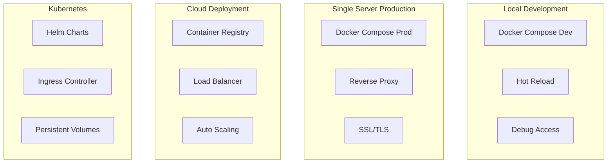

# Thoth AI Research Assistant - Deployment Guide

This guide covers various deployment scenarios for Thoth, from local development to production cloud deployments.

## Table of Contents

- [Overview](#overview)
- [Local Development](#local-development)
- [Single Server Production](#single-server-production)
- [Cloud Deployment](#cloud-deployment)
- [Kubernetes Deployment](#kubernetes-deployment)
- [Scaling and Load Balancing](#scaling-and-load-balancing)
- [Monitoring and Observability](#monitoring-and-observability)
- [Security Best Practices](#security-best-practices)

## Overview

### Multi-Service Architecture (v0.2.0+)

Thoth now supports **completely separated, independently scalable services**:

- **🧠 Memory Service**: Letta-based hierarchical memory system (separate container) - [Setup Guide](letta-docker-setup.md)
- **💬 Chat Agent**: Research agent with MCP tools (main application)
- **🔍 Discovery Service**: Automated paper discovery (can run separately)
- **🗄️ Vector Database**: ChromaDB for RAG operations (separate container)
- **📊 Monitoring Stack**: Prometheus + Grafana (separate containers)

### Recent Infrastructure Updates (v0.1.0+)

The Docker deployment system has been significantly improved:

- **UV Package Manager**: Faster builds with improved caching (10x speed improvement)
- **CLI Integration**: Updated to use `server start` subcommand for proper service orchestration
- **Multi-stage Builds**: Optimized production images with reduced size
- **Environment Compatibility**: All environment variables and service references updated
- **Health Monitoring**: Comprehensive health checks and monitoring capabilities
- **Service Separation**: Complete isolation and independent scaling of services

### Deployment Architecture Options



## Local Development

### Multi-Service Development Setup (Recommended)

Deploy all services separately for development with full isolation and scaling capabilities.

1. **Clone and Initialize**:
   ```bash
   git clone <repository-url>
   cd project-thoth
   make check-deps
   ```

2. **Configure All Services**:
   ```bash
   # Main application
   cp .env.example .env
   # Edit .env with your API keys

   # Memory service
   cp deployment/letta-memory-service/.env.example deployment/letta-memory-service/.env
   # Edit with Letta configuration
   ```

3. **Start Development Environment**:
   ```bash
   # Start all services in development mode
   ./scripts/start-all-services.sh dev

   # Or start services individually
   make -f Makefile.services start-memory      # Memory service
   make -f Makefile.services start-chat        # Chat agent
   make -f Makefile.services start-vector-db   # Vector database
   make -f Makefile.services start-monitoring  # Monitoring (optional)
   ```

4. **Verify Services**:
   ```bash
   # Check all service health
   ./scripts/start-all-services.sh status

   # Or check individual services
   make -f Makefile.services health-check
   ```

### Traditional Single-Container Setup

1. **Initialize Docker Environment**:
   ```bash
   make docker-init
   ```

2. **Configure Environment**:
   ```bash
   cp .env.docker.example .env.docker
   # Edit .env.docker with your API keys
   ```

3. **Start Development Environment**:
   ```bash
   # Build and start all services in one container
   make docker-dev
   ```

### Development Features

- **Hot Reload**: Code changes trigger automatic restarts
- **Debug Access**: Python debugger on port 5678
- **Live Logs**: Real-time log streaming
- **Volume Mounts**: Source code editing without rebuilds

### Development Commands

```bash
# Start development environment
make docker-dev

# View logs
make docker-logs-dev

# Access container shell
make docker-shell-dev

# Run tests
docker exec thoth-app-dev pytest tests/

# Stop development environment
make docker-down-dev
```

## Single Server Production

### Multi-Service Production Deployment (Recommended)

Deploy all services separately on a single server for better resource utilization and fault isolation.

#### Prerequisites
- Linux server (Ubuntu 20.04+ recommended)
- 8+ GB RAM, 4+ CPU cores (for multi-service)
- 100+ GB disk space
- Docker and Docker Compose installed
- Domain name (optional, for SSL)

#### Quick Production Deployment
```bash
# 1. Clone repository
git clone <repository-url>
cd project-thoth

# 2. Configure all services
cp .env.example .env
cp deployment/letta-memory-service/.env.example deployment/letta-memory-service/.env
# Edit both files with production settings

# 3. Start production environment
./scripts/start-all-services.sh prod

# 4. Verify deployment
./scripts/start-all-services.sh status
```

#### Service URLs (Production)
- **Main API**: http://localhost:8000
- **MCP Server**: http://localhost:8001
- **Memory Service**: http://localhost:8283
- **Vector Database**: http://localhost:8003
- **Prometheus**: http://localhost:9090
- **Grafana**: http://localhost:3000

### Traditional Single-Container Production

For simpler deployments with all services in one container.

#### Prerequisites
- Linux server (Ubuntu 20.04+ recommended)
- 4+ GB RAM, 2+ CPU cores
- 50+ GB disk space
- Docker and Docker Compose installed
- Domain name (optional, for SSL)

#### Traditional Deployment Steps

##### 1. Server Preparation

```bash
# Update system
sudo apt update && sudo apt upgrade -y

# Install Docker
curl -fsSL https://get.docker.com -o get-docker.sh
sudo sh get-docker.sh

# Install Docker Compose
sudo apt install docker-compose-plugin

# Create thoth user
sudo useradd -m -s /bin/bash thoth
sudo usermod -aG docker thoth

# Create data directories
sudo mkdir -p /opt/thoth/{data,workspace,logs,cache}
sudo chown -R thoth:thoth /opt/thoth/
```

#### 2. Application Deployment

```bash
# Switch to thoth user
sudo su - thoth

# Clone repository
git clone <repository-url>
cd project-thoth

# Configure production environment
cp .env.prod.example .env.prod
nano .env.prod  # Add your API keys and configuration

# Build and deploy
make docker-build-prod
make docker-up-prod
```

#### 3. Reverse Proxy Setup (Nginx)

Create `/etc/nginx/sites-available/thoth`:

```nginx
server {
    listen 80;
    server_name yourdomain.com;

    # Redirect HTTP to HTTPS
    return 301 https://$server_name$request_uri;
}

server {
    listen 443 ssl http2;
    server_name yourdomain.com;

    # SSL configuration
    ssl_certificate /etc/letsencrypt/live/yourdomain.com/fullchain.pem;
    ssl_certificate_key /etc/letsencrypt/live/yourdomain.com/privkey.pem;

    # Security headers
    add_header X-Content-Type-Options nosniff;
    add_header X-Frame-Options DENY;
    add_header X-XSS-Protection "1; mode=block";

    # API proxy
    location /api/ {
        proxy_pass http://localhost:8000/;
        proxy_set_header Host $host;
        proxy_set_header X-Real-IP $remote_addr;
        proxy_set_header X-Forwarded-For $proxy_add_x_forwarded_for;
        proxy_set_header X-Forwarded-Proto $scheme;
    }

    # WebSocket proxy
    location /ws {
        proxy_pass http://localhost:8000/ws;
        proxy_http_version 1.1;
        proxy_set_header Upgrade $http_upgrade;
        proxy_set_header Connection "upgrade";
        proxy_set_header Host $host;
        proxy_set_header X-Real-IP $remote_addr;
        proxy_set_header X-Forwarded-For $proxy_add_x_forwarded_for;
        proxy_set_header X-Forwarded-Proto $scheme;
    }

    # Health check endpoint
    location /health {
        proxy_pass http://localhost:8000/health;
        access_log off;
    }
}
```

#### 4. SSL Certificate Setup

```bash
# Install Certbot
sudo apt install certbot python3-certbot-nginx

# Obtain SSL certificate
sudo certbot --nginx -d yourdomain.com

# Test automatic renewal
sudo certbot renew --dry-run
```

#### 5. Systemd Service (Optional)

Create `/etc/systemd/system/thoth.service`:

```ini
[Unit]
Description=Thoth AI Research Assistant
After=docker.service
Requires=docker.service

[Service]
Type=oneshot
RemainAfterExit=yes
WorkingDirectory=/home/thoth/project-thoth
ExecStart=/usr/bin/docker compose -f docker-compose.prod.yml up -d
ExecStop=/usr/bin/docker compose -f docker-compose.prod.yml down
User=thoth
Group=thoth

[Install]
WantedBy=multi-user.target
```

```bash
# Enable and start service
sudo systemctl daemon-reload
sudo systemctl enable thoth.service
sudo systemctl start thoth.service
```

### Production Monitoring

#### Health Checks

```bash
# Application health
curl https://yourdomain.com/health

# Docker service status
make docker-ps

# Resource usage
docker stats
```

#### Log Management

```bash
# Application logs
make docker-logs

# System logs
journalctl -u thoth.service

# Nginx logs
sudo tail -f /var/log/nginx/access.log
sudo tail -f /var/log/nginx/error.log
```

## Cloud Deployment

### AWS Deployment

#### Using ECS (Elastic Container Service)

1. **Create ECS Cluster**:
   ```bash
   aws ecs create-cluster --cluster-name thoth-cluster
   ```

2. **Build and Push Images**:
   ```bash
   # Build image
   docker build -t thoth-app:latest .

   # Tag for ECR
   docker tag thoth-app:latest 123456789012.dkr.ecr.us-west-2.amazonaws.com/thoth:latest

   # Push to ECR
   aws ecr get-login-password --region us-west-2 | docker login --username AWS --password-stdin 123456789012.dkr.ecr.us-west-2.amazonaws.com
   docker push 123456789012.dkr.ecr.us-west-2.amazonaws.com/thoth:latest
   ```

3. **Create Task Definition**:
   ```json
   {
     "family": "thoth-task",
     "networkMode": "awsvpc",
     "requiresCompatibilities": ["FARGATE"],
     "cpu": "1024",
     "memory": "2048",
     "taskRoleArn": "arn:aws:iam::123456789012:role/ecsTaskRole",
     "containerDefinitions": [
       {
         "name": "thoth-app",
         "image": "123456789012.dkr.ecr.us-west-2.amazonaws.com/thoth:latest",
         "portMappings": [
           {
             "containerPort": 8000,
             "protocol": "tcp"
           }
         ],
         "environment": [
           {
             "name": "API_MISTRAL_KEY",
             "value": "your-key-here"
           }
         ]
       }
     ]
   }
   ```

#### Using EC2 with Docker Compose

```bash
# Launch EC2 instance
aws ec2 run-instances \
  --image-id ami-0c55b159cbfafe1d0 \
  --count 1 \
  --instance-type t3.medium \
  --key-name your-key-pair \
  --security-groups thoth-sg \
  --user-data file://user-data.sh
```

User data script:
```bash
#!/bin/bash
yum update -y
yum install -y docker
service docker start
usermod -a -G docker ec2-user

# Install docker-compose
curl -L "https://github.com/docker/compose/releases/download/v2.0.1/docker-compose-$(uname -s)-$(uname -m)" -o /usr/local/bin/docker-compose
chmod +x /usr/local/bin/docker-compose

# Clone and deploy
cd /home/ec2-user
git clone <repository-url> project-thoth
cd project-thoth
make docker-prod
```

### Google Cloud Platform (GCP)

#### Using Cloud Run

1. **Build and Push to Container Registry**:
   ```bash
   # Configure Docker for GCP
   gcloud auth configure-docker

   # Build and push
   docker build -t gcr.io/PROJECT_ID/thoth-app .
   docker push gcr.io/PROJECT_ID/thoth-app
   ```

2. **Deploy to Cloud Run**:
   ```bash
   gcloud run deploy thoth-app \
     --image gcr.io/PROJECT_ID/thoth-app \
     --platform managed \
     --region us-central1 \
     --allow-unauthenticated \
     --memory 2Gi \
     --cpu 1 \
     --set-env-vars API_MISTRAL_KEY=your-key
   ```

### Azure Deployment

#### Using Container Instances

```bash
# Create resource group
az group create --name thoth-rg --location eastus

# Create container instance
az container create \
  --resource-group thoth-rg \
  --name thoth-app \
  --image your-registry/thoth-app:latest \
  --cpu 1 \
  --memory 2 \
  --port 8000 \
  --dns-name-label thoth-app \
  --environment-variables API_MISTRAL_KEY=your-key
```

## Kubernetes Deployment

### Prerequisites

- Kubernetes cluster (v1.20+)
- kubectl configured
- Helm 3.x installed

### Deployment Steps

#### 1. Create Namespace

```yaml
# namespace.yaml
apiVersion: v1
kind: Namespace
metadata:
  name: thoth
```

#### 2. Configure Secrets

```yaml
# secrets.yaml
apiVersion: v1
kind: Secret
metadata:
  name: thoth-secrets
  namespace: thoth
type: Opaque
data:
  mistral-key: <base64-encoded-key>
  openrouter-key: <base64-encoded-key>
```

#### 3. Create ConfigMap

```yaml
# configmap.yaml
apiVersion: v1
kind: ConfigMap
metadata:
  name: thoth-config
  namespace: thoth
data:
  THOTH_LOG_LEVEL: "INFO"
  THOTH_API_HOST: "0.0.0.0"
  THOTH_API_PORT: "8000"
```

#### 4. ChromaDB Deployment

```yaml
# chromadb-deployment.yaml
apiVersion: apps/v1
kind: Deployment
metadata:
  name: chromadb
  namespace: thoth
spec:
  replicas: 1
  selector:
    matchLabels:
      app: chromadb
  template:
    metadata:
      labels:
        app: chromadb
    spec:
      containers:
      - name: chromadb
        image: chromadb/chroma:latest
        ports:
        - containerPort: 8003
        env:
        - name: IS_PERSISTENT
          value: "TRUE"
        - name: PERSIST_DIRECTORY
          value: "/chroma/chroma"
        volumeMounts:
        - name: chroma-data
          mountPath: /chroma/chroma
      volumes:
      - name: chroma-data
        persistentVolumeClaim:
          claimName: chroma-pvc
---
apiVersion: v1
kind: Service
metadata:
  name: chromadb-service
  namespace: thoth
spec:
  selector:
    app: chromadb
  ports:
  - port: 8003
    targetPort: 8003
```

#### 5. Thoth App Deployment

```yaml
# thoth-deployment.yaml
apiVersion: apps/v1
kind: Deployment
metadata:
  name: thoth-app
  namespace: thoth
spec:
  replicas: 2
  selector:
    matchLabels:
      app: thoth-app
  template:
    metadata:
      labels:
        app: thoth-app
    spec:
      containers:
      - name: thoth-app
        image: your-registry/thoth-app:latest
        ports:
        - containerPort: 8000
        - containerPort: 8001
        envFrom:
        - configMapRef:
            name: thoth-config
        env:
        - name: API_MISTRAL_KEY
          valueFrom:
            secretKeyRef:
              name: thoth-secrets
              key: mistral-key
        - name: THOTH_CHROMADB_URL
          value: "http://chromadb-service:8003"
        volumeMounts:
        - name: workspace-data
          mountPath: /workspace
        livenessProbe:
          httpGet:
            path: /health
            port: 8000
          initialDelaySeconds: 60
          periodSeconds: 30
        readinessProbe:
          httpGet:
            path: /health
            port: 8000
          initialDelaySeconds: 30
          periodSeconds: 10
      volumes:
      - name: workspace-data
        persistentVolumeClaim:
          claimName: workspace-pvc
```

#### 6. Ingress Configuration

```yaml
# ingress.yaml
apiVersion: networking.k8s.io/v1
kind: Ingress
metadata:
  name: thoth-ingress
  namespace: thoth
  annotations:
    cert-manager.io/cluster-issuer: "letsencrypt-prod"
    nginx.ingress.kubernetes.io/websocket-services: "thoth-service"
spec:
  tls:
  - hosts:
    - thoth.yourdomain.com
    secretName: thoth-tls
  rules:
  - host: thoth.yourdomain.com
    http:
      paths:
      - path: /
        pathType: Prefix
        backend:
          service:
            name: thoth-service
            port:
              number: 8000
```

### Helm Chart Deployment

Create a Helm chart for easier management:

```yaml
# values.yaml
image:
  repository: your-registry/thoth-app
  tag: latest
  pullPolicy: IfNotPresent

replicaCount: 2

service:
  type: ClusterIP
  port: 8000

ingress:
  enabled: true
  className: nginx
  annotations:
    cert-manager.io/cluster-issuer: letsencrypt-prod
  hosts:
    - host: thoth.yourdomain.com
      paths:
        - path: /
          pathType: ImplementationSpecific
  tls:
    - secretName: thoth-tls
      hosts:
        - thoth.yourdomain.com

resources:
  limits:
    cpu: 1000m
    memory: 2Gi
  requests:
    cpu: 500m
    memory: 1Gi

persistence:
  enabled: true
  storageClass: gp2
  size: 50Gi
```

Deploy with Helm:
```bash
helm install thoth ./helm/thoth -f values.yaml -n thoth
```

## Scaling and Load Balancing

### Horizontal Scaling

#### Docker Compose (Simple)

```yaml
# docker-compose.scale.yml
services:
  thoth-app:
    scale: 3

  nginx:
    image: nginx:alpine
    volumes:
      - ./nginx-lb.conf:/etc/nginx/nginx.conf
    ports:
      - "80:80"
    depends_on:
      - thoth-app
```

#### Kubernetes Horizontal Pod Autoscaler

```yaml
apiVersion: autoscaling/v2
kind: HorizontalPodAutoscaler
metadata:
  name: thoth-hpa
  namespace: thoth
spec:
  scaleTargetRef:
    apiVersion: apps/v1
    kind: Deployment
    name: thoth-app
  minReplicas: 2
  maxReplicas: 10
  metrics:
  - type: Resource
    resource:
      name: cpu
      target:
        type: Utilization
        averageUtilization: 70
  - type: Resource
    resource:
      name: memory
      target:
        type: Utilization
        averageUtilization: 80
```

### Load Balancer Configuration

#### Nginx Load Balancer

```nginx
upstream thoth_backend {
    least_conn;
    server thoth-app-1:8000;
    server thoth-app-2:8000;
    server thoth-app-3:8000;
}

server {
    listen 80;
    location / {
        proxy_pass http://thoth_backend;
        proxy_set_header Host $host;
        proxy_set_header X-Real-IP $remote_addr;
    }

    # WebSocket support
    location /ws {
        proxy_pass http://thoth_backend;
        proxy_http_version 1.1;
        proxy_set_header Upgrade $http_upgrade;
        proxy_set_header Connection "upgrade";
    }
}
```

## Monitoring and Observability

### Prometheus Monitoring

```yaml
# prometheus.yml
global:
  scrape_interval: 15s

scrape_configs:
  - job_name: 'thoth'
    static_configs:
      - targets: ['thoth-app:8000']
    metrics_path: '/metrics'
    scrape_interval: 30s
```

### Grafana Dashboard

Key metrics to monitor:
- Request rate and latency
- Memory and CPU usage
- ChromaDB query performance
- Agent system response times
- Error rates

### Logging with ELK Stack

```yaml
# filebeat.yml
filebeat.inputs:
- type: docker
  containers.ids:
    - '*'
  processors:
  - add_docker_metadata: ~

output.elasticsearch:
  hosts: ["elasticsearch:9200"]
```

## Security Best Practices

### Container Security

1. **Use non-root users**:
   ```dockerfile
   USER thoth
   ```

2. **Read-only filesystems**:
   ```yaml
   security_opt:
     - no-new-privileges:true
   read_only: true
   ```

3. **Security scanning**:
   ```bash
   # Scan images for vulnerabilities
   trivy image thoth-app:latest
   ```

### Network Security

1. **Internal networks**:
   ```yaml
   networks:
     internal:
       internal: true
   ```

2. **Firewall configuration**:
   ```bash
   ufw allow 22/tcp    # SSH
   ufw allow 80/tcp    # HTTP
   ufw allow 443/tcp   # HTTPS
   ufw deny 8000/tcp   # Block direct access to API
   ```

### Secrets Management

1. **Docker secrets**:
   ```bash
   echo "api_key" | docker secret create mistral_key -
   ```

2. **Kubernetes secrets**:
   ```bash
   kubectl create secret generic thoth-secrets \
     --from-literal=mistral-key=your-key \
     --namespace thoth
   ```

3. **External secret management** (AWS Secrets Manager, Azure Key Vault, etc.)

### SSL/TLS Configuration

```nginx
# Strong SSL configuration
ssl_protocols TLSv1.2 TLSv1.3;
ssl_ciphers ECDHE-RSA-AES256-GCM-SHA512:DHE-RSA-AES256-GCM-SHA512;
ssl_prefer_server_ciphers off;
ssl_session_cache shared:SSL:10m;
ssl_session_timeout 10m;
```

This deployment guide provides comprehensive instructions for various deployment scenarios. Choose the approach that best fits your infrastructure and requirements.
