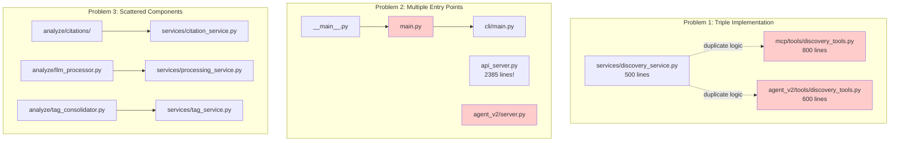
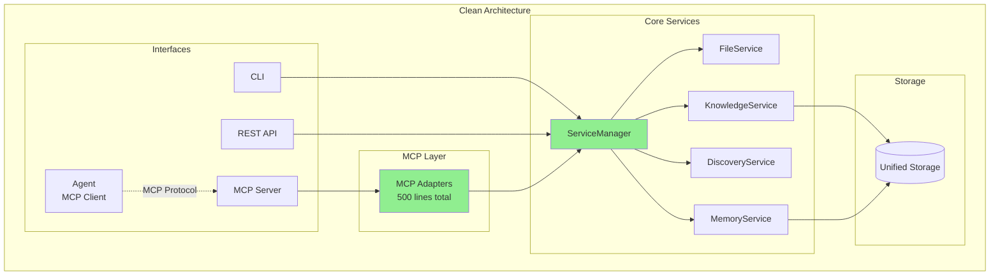

# Thoth Codebase Refactoring Plan

## Current State Analysis

### What Works Well

1. **Core Functionality**
   - OCR processing (Mistral API integration)
   - LLM analysis (OpenRouter/Anthropic/OpenAI support)
   - Citation extraction and graph management
   - RAG system with embeddings
   - Discovery system with multiple sources
   - File watching and automatic processing

2. **Service Layer** (`/src/thoth/services/`)
   - Well-organized service classes
   - Clear separation of concerns
   - Good abstraction over external APIs
   - ServiceManager provides centralized access

3. **Knowledge Management**
   - CitationGraph tracks relationships
   - Letta integration for agent memory
   - Vector store for RAG queries
   - Markdown note generation

### Current Architecture Problems



### File Structure Overview

```
src/thoth/
├── __main__.py (15 lines) - Calls main.py
├── main.py (15 lines) - Calls cli/main.py
├── pipeline.py (306 lines) - DEPRECATED, but still imported
├── analyze/
│   ├── citations/ (6 files, ~3000 lines total)
│   ├── llm_processor.py (490 lines)
│   └── tag_consolidator.py (537 lines)
├── cli/ (10 command modules)
├── config/
│   └── simplified.py (207 lines) - Migration code
├── discovery/
│   ├── api_sources.py (1261 lines) - Multiple API clients
│   └── [other discovery files]
├── ingestion/
│   └── agent_v2/
│       ├── server.py - Duplicate FastAPI server
│       └── tools/ (10 files, ~8000 lines) - Duplicate implementations
├── mcp/
│   ├── server.py
│   └── tools/ (13 files, ~10000 lines) - Duplicate implementations
├── services/ - GOOD! Keep these
│   ├── service_manager.py
│   └── [all service implementations]
├── server/
│   └── api_server.py (2385 lines) - Monolithic
└── utilities/
    └── config.py (1195 lines) - 20+ config classes
```

## Target Architecture



## Phase-by-Phase Implementation Plan

### Phase 1: Create MCP Adapter Layer (Week 1)

**Goal**: Create thin MCP adapters without breaking existing code

#### Step 1.1: Create adapter structure
```bash
mkdir -p src/thoth/adapters/mcp
touch src/thoth/adapters/__init__.py
touch src/thoth/adapters/mcp/__init__.py
touch src/thoth/adapters/mcp/base.py
touch src/thoth/adapters/mcp/discovery.py
touch src/thoth/adapters/mcp/processing.py
touch src/thoth/adapters/mcp/knowledge.py
```

#### Step 1.2: Implement base adapter
**File**: `src/thoth/adapters/mcp/base.py`
```python
from typing import Any, Dict, List
from thoth.services.service_manager import ServiceManager

class MCPAdapter:
    """Base adapter for exposing services via MCP protocol"""
    
    def __init__(self, service_manager: ServiceManager):
        self.services = service_manager
    
    def get_tools(self) -> List[Dict[str, Any]]:
        """Return MCP tool definitions"""
        raise NotImplementedError
```

#### Step 1.3: Implement service adapters
**File**: `src/thoth/adapters/mcp/discovery.py`
```python
class DiscoveryMCPAdapter(MCPAdapter):
    def get_tools(self):
        return [{
            "name": "create_discovery_job",
            "handler": lambda args: self.services.discovery.create_job(**args),
            # ... other tool definitions
        }]
```

#### Step 1.4: Update MCP server to use adapters
**Edit**: `src/thoth/mcp/server.py`
```python
# Add imports
from thoth.adapters.mcp import get_all_adapters

# Replace tool registration
def register_tools(self):
    # OLD: self.tools.extend(all_mcp_tools)
    # NEW:
    adapters = get_all_adapters(self.service_manager)
    for adapter in adapters:
        self.tools.extend(adapter.get_tools())
```

**Test**: Verify MCP tools still work through adapters

### Phase 2: Convert Agent to MCP Client (Week 2)

**Goal**: Make agent use MCP instead of its own tools

#### Step 2.1: Create MCP client wrapper
**File**: `src/thoth/ingestion/agent_v2/mcp_client.py`
```python
from typing import Any, Dict, List
import httpx

class AgentMCPClient:
    def __init__(self, mcp_url: str = "http://localhost:8000/mcp"):
        self.mcp_url = mcp_url
        self.client = httpx.AsyncClient()
    
    async def list_tools(self) -> List[Dict[str, Any]]:
        response = await self.client.get(f"{self.mcp_url}/tools")
        return response.json()
    
    async def call_tool(self, tool_name: str, args: Dict[str, Any]):
        response = await self.client.post(
            f"{self.mcp_url}/tools/{tool_name}",
            json=args
        )
        return response.json()
```

#### Step 2.2: Update agent to use MCP client
**Edit**: `src/thoth/ingestion/agent_v2/core/agent.py`
```python
# Replace tool imports
# OLD: from ..tools import *
# NEW:
from ..mcp_client import AgentMCPClient

class Agent:
    def __init__(self):
        # OLD: self.tools = [AnalysisTool(), DiscoveryTool(), ...]
        # NEW:
        self.mcp_client = AgentMCPClient()
        self.tools = None  # Loaded dynamically
    
    async def initialize(self):
        self.tools = await self.mcp_client.list_tools()
```

#### Step 2.3: Update agent server
**Edit**: `src/thoth/ingestion/agent_v2/server.py`
- Remove duplicate FastAPI app
- Make it a simple agent runner that connects to main API

**Test**: Verify agent can use all tools via MCP

### Phase 3: Remove Duplicate Implementations (Week 3)

**Goal**: Delete duplicate code, consolidate components

#### Step 3.1: Remove MCP tool implementations
```bash
# Keep only the adapter-related files
rm -rf src/thoth/mcp/tools/*.py
# Keep base_tools.py if needed for protocol
git rm src/thoth/mcp/tools/discovery_tools.py
git rm src/thoth/mcp/tools/processing_tools.py
# ... remove all 13 tool files
```

#### Step 3.2: Remove agent tool implementations
```bash
rm -rf src/thoth/ingestion/agent_v2/tools/
git rm -rf src/thoth/ingestion/agent_v2/tools/
```

#### Step 3.3: Consolidate analyze components into services
**Move logic from**:
- `analyze/llm_processor.py` → `services/processing_service.py`
- `analyze/tag_consolidator.py` → `services/tag_service.py`
- `analyze/citations/*` → `services/citation_service.py`

**Delete analyze module**:
```bash
git rm -rf src/thoth/analyze/
```

#### Step 3.4: Update imports across codebase
```bash
# Find and replace all imports
grep -r "from thoth.analyze" --include="*.py" src/
# Update each file to import from services instead
```

**Test**: Run full test suite, fix any broken imports

### Phase 4: Simplify Entry Points (Week 4)

**Goal**: Clean up entry points and pipeline classes

#### Step 4.1: Consolidate entry points
**Edit**: `src/thoth/__main__.py`
```python
#!/usr/bin/env python3
import sys
from thoth.cli.main import main

if __name__ == '__main__':
    sys.exit(main())
```

**Delete**: `src/thoth/main.py`
```bash
git rm src/thoth/main.py
```

#### Step 4.2: Consolidate pipeline classes
**Create**: `src/thoth/pipelines/unified_pipeline.py`
- Merge logic from ThothPipeline, DocumentPipeline, OptimizedDocumentPipeline
- Make optimizations configuration-based

**Update**: `src/thoth/__init__.py`
```python
# OLD: from thoth.pipeline import ThothPipeline
# NEW: from thoth.pipelines.unified_pipeline import Pipeline
```

#### Step 4.3: Update CLI to use new pipeline
**Edit**: `src/thoth/cli/main.py`
```python
# OLD: pipeline = ThothPipeline()
# NEW: pipeline = Pipeline()
```

**Test**: Verify all CLI commands work

### Phase 5: Refactor Large Files (Week 5)

**Goal**: Break up monolithic files

#### Step 5.1: Break up api_server.py
**Create structure**:
```
src/thoth/server/
├── __init__.py
├── app.py (main FastAPI app, <200 lines)
├── routers/
│   ├── __init__.py
│   ├── chat.py
│   ├── discovery.py
│   ├── health.py
│   └── websocket.py
├── middleware.py
└── dependencies.py
```

#### Step 5.2: Simplify configuration
**Create**: `src/thoth/config.py`
```python
from pydantic_settings import BaseSettings

class ThothConfig(BaseSettings):
    # Core settings
    workspace_dir: Path = Path(".")
    
    # API Keys
    openrouter_key: str | None = None
    mistral_key: str | None = None
    
    # Service settings
    class ServiceConfig(BaseSettings):
        ocr_model: str = "mistral-large-latest"
        llm_model: str = "anthropic/claude-3.5-sonnet"
    
    services: ServiceConfig = ServiceConfig()
```

**Delete old config**:
```bash
git rm src/thoth/config/simplified.py
git rm src/thoth/utilities/config.py
```

#### Step 5.3: Convert CitationGraph to service
**Create**: `src/thoth/services/graph_service.py`
- Move core logic from knowledge/graph.py
- Make it follow service pattern

**Test**: Full integration test

### Phase 6: Polish and Documentation (Week 6)

**Goal**: Final cleanup and documentation

#### Step 6.1: Add comprehensive tests
```bash
# Create test structure
tests/
├── unit/
│   ├── test_services/
│   ├── test_adapters/
│   └── test_pipelines/
├── integration/
│   ├── test_mcp_flow.py
│   ├── test_agent_flow.py
│   └── test_discovery_flow.py
└── e2e/
    └── test_full_pipeline.py
```

#### Step 6.2: Update documentation
**Create**: `docs/architecture.md`
- Explain service layer
- Document MCP protocol usage
- Show data flow diagrams

**Update**: `README.md`
- Clear setup instructions
- Architecture overview
- Example usage

#### Step 6.3: Add deployment configurations
**Create**: `deployment/`
```
deployment/
├── docker/
│   ├── Dockerfile
│   └── docker-compose.yml
├── kubernetes/
│   └── thoth-deployment.yaml
└── scripts/
    ├── setup.sh
    └── start.sh
```

## Success Metrics

### Before Refactoring
- **Lines of Code**: ~30,000
- **Duplicate Implementations**: 3x for each feature
- **Test Coverage**: Unknown
- **Setup Time**: Complex, many steps
- **File Sizes**: Multiple files >1000 lines

### After Refactoring
- **Lines of Code**: ~15,000 (50% reduction)
- **Duplicate Implementations**: 0 (single source of truth)
- **Test Coverage**: >80%
- **Setup Time**: `./setup.sh && thoth start`
- **File Sizes**: No file >500 lines

## Risk Mitigation

1. **Keep old code during transition**
   - Use feature flags to switch between old/new
   - Delete only after thorough testing

2. **Test at each phase**
   - Integration tests before moving to next phase
   - Keep CI/CD green throughout

3. **Document changes**
   - Update docs as you go
   - Keep changelog of what moved where

This plan transforms the codebase from a working but complex system into a clean, production-ready showcase of engineering excellence.