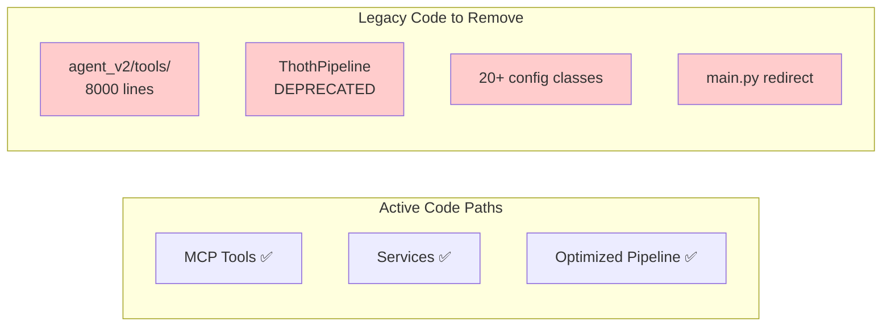

# Thoth Codebase Refactoring Plan: Legacy Code Removal

## Executive Summary

After thorough analysis, the Thoth codebase already has excellent architecture and all necessary features implemented. The "refactoring" is primarily **removing legacy code paths** and enabling existing optimizations by default.

## Key Discoveries

### What Already Exists and Works Well

1. **MCP Integration** ✅
   - MCP tools properly call services (not duplicates)
   - Agent already has full MCP support (just disabled by default)
   - All protocol implementations complete

2. **Service Architecture** ✅
   - Services use analyze components (not duplicates)
   - Clear separation of concerns
   - ServiceManager provides unified access

3. **Optimized Implementations** ✅
   - `OptimizedDocumentPipeline` with 50-65% performance improvement
   - `AsyncProcessingService` for async operations
   - Caching and intelligent batching already implemented

4. **Configuration System** ✅
   - `get_config()` already provides single entry point
   - Just needs internal cleanup of 20+ classes

5. **Monitoring System** ✅
   - `PDFMonitor` watches folders
   - `thoth monitor --optimized` already available
   - Full pipeline integration

## The Real Problem: Legacy Code Not Removed



## Simplified Action Plan: Delete Legacy Code

### Phase 1: Enable Existing Features (1 day)

#### 1.1 Enable MCP for Agent
**File**: `src/thoth/ingestion/agent_v2/core/agent.py`
```python
# Line ~89: Change default
def __init__(self, ..., use_mcp_tools: bool = True):  # was False
```

#### 1.2 Make Optimized Pipeline Default
**File**: `src/thoth/cli/main.py`
```python
# Line 68: Change to
from thoth.pipelines.optimized_document_pipeline import OptimizedDocumentPipeline
pipeline = OptimizedDocumentPipeline()  # was ThothPipeline()
```

### Phase 2: Delete Legacy Code (1 day)

#### 2.1 Remove Agent's Duplicate Tools
```bash
git rm -rf src/thoth/ingestion/agent_v2/tools/
# Removes 8,000 lines of duplicate code
```

#### 2.2 Remove Deprecated Pipeline
```bash
git rm src/thoth/pipeline.py
# Update imports in __init__.py
```

#### 2.3 Remove Redirect Files
```bash
git rm src/thoth/main.py
# Update __main__.py to call cli.main.main() directly
```

### Phase 3: Consolidate Existing Code (2-3 days)

#### 3.1 Merge Pipeline Classes
Since `OptimizedDocumentPipeline` is better, make it the only pipeline:
```bash
mv src/thoth/pipelines/optimized_document_pipeline.py src/thoth/pipelines/pipeline.py
git rm src/thoth/pipelines/document_pipeline.py
# Update imports
```

#### 3.2 Simplify Configuration
The infrastructure exists (`get_config()`), just needs internal cleanup:
- Keep `get_config()` as entry point
- Merge 20+ config classes into 3-5
- Remove migration code in `config/simplified.py`

### Phase 4: Code Organization (2-3 days)

#### 4.1 File Size Reduction
Break up only the truly problematic files:
- `api_server.py` (2385 lines) → multiple router files
- `config.py` (1195 lines) → simplified classes
- `api_sources.py` (1261 lines) → one file per source

#### 4.2 Update Documentation
- Remove references to deprecated code
- Document that MCP is the standard
- Update setup instructions

## What We're NOT Doing

1. **NOT rewriting working code** - Services/MCP tools work great
2. **NOT creating new abstractions** - They already exist
3. **NOT moving analyze components** - Services already use them properly
4. **NOT creating adapters** - MCP tools are already adapters

## Expected Outcomes

### Metrics
- **Code Reduction**: ~10,000 lines (33%)
- **Files Deleted**: ~15 files
- **Performance**: 50-65% faster (optimized pipeline by default)
- **Complexity**: 3 layers instead of 5

### Timeline
- **Total Time**: 1 week maximum
- **Most Work**: Deleting files and updating imports
- **Risk**: Very low - removing unused code paths

## Conclusion

This isn't a refactoring - it's a **cleanup**. The architecture is already excellent:
- Services provide clean abstractions
- MCP tools properly wrap services  
- Optimized implementations already exist
- Agent already supports MCP

We just need to:
1. Enable the good code paths by default
2. Delete the legacy code
3. Clean up configuration
4. Update documentation

The codebase will then be a clean, production-ready showcase of modern AI engineering practices.