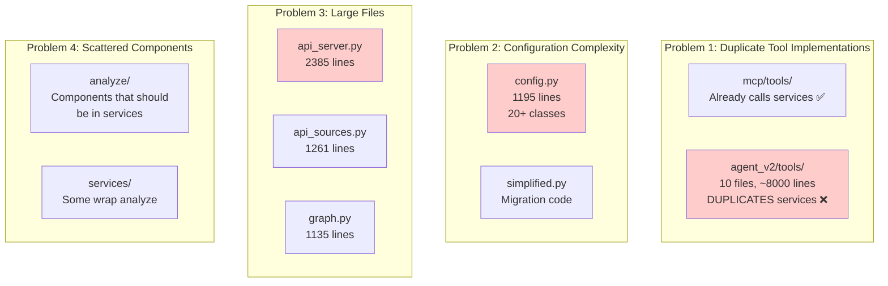

# Thoth Codebase Refactoring Plan

## Current State Analysis

### What Works Well

1. **Core Functionality**
   - OCR processing (Mistral API integration)
   - LLM analysis (OpenRouter/Anthropic/OpenAI support)
   - Citation extraction and graph management
   - RAG system with embeddings
   - Discovery system with multiple sources
   - File watching and automatic processing

2. **Service Layer** (`/src/thoth/services/`)
   - Well-organized service classes
   - Clear separation of concerns
   - Good abstraction over external APIs
   - ServiceManager provides centralized access

3. **MCP Implementation** (`/src/thoth/mcp/`)
   - **MCP tools already call services** (not duplicates!)
   - Each tool inherits from `MCPTool` with `service_manager`
   - Tools are thin wrappers: `self.service_manager.discovery.list_sources()`
   - Proper MCP protocol implementation

4. **Agent MCP Integration**
   - Agent already supports MCP via `use_mcp_tools` flag
   - Uses `langchain_mcp_adapters` for MCP client
   - Falls back to legacy tools if MCP fails

### Current Architecture Problems



## Simplified Refactoring Plan

Since MCP tools already properly call services, we need much less work:

### Phase 1: Enable MCP for Agent (Week 1)

**Goal**: Make agent use MCP exclusively, remove duplicate tools

#### Step 1.1: Update agent configuration
**Edit**: `src/thoth/ingestion/agent_v2/core/agent.py`
```python
# Change default to always use MCP
def __init__(self, use_mcp_tools: bool = True):  # Was False by default
```

#### Step 1.2: Remove fallback to legacy tools
**Edit**: `src/thoth/ingestion/agent_v2/core/agent.py`
```python
# Remove lines 134-139 that fall back to legacy tools
# Keep only MCP initialization
```

#### Step 1.3: Delete agent tools directory
```bash
# These are the duplicate implementations
git rm -rf src/thoth/ingestion/agent_v2/tools/
```

#### Step 1.4: Update agent server
**Edit**: `src/thoth/ingestion/agent_v2/server.py`
- Ensure it uses main MCP server
- Remove any tool registration code

**Test**: Verify agent works with MCP tools only

### Phase 2: Consolidate Components (Week 2)

**Goal**: Move analyze components to services, remove duplication

#### Step 2.1: Check what's already in services
```bash
# Compare functionality
diff -u src/thoth/analyze/llm_processor.py src/thoth/services/processing_service.py
diff -u src/thoth/analyze/tag_consolidator.py src/thoth/services/tag_service.py
```

#### Step 2.2: Move unique logic to services
- If `analyze/` has logic not in services, move it
- If services already have the logic, just update imports

#### Step 2.3: Delete analyze module
```bash
git rm -rf src/thoth/analyze/
```

#### Step 2.4: Update all imports
```bash
# Find all imports from analyze
grep -r "from thoth.analyze" --include="*.py" src/
# Update to import from services
```

### Phase 3: Simplify Configuration (Week 3)

**Goal**: Reduce configuration complexity

#### Step 3.1: Create unified config
**File**: `src/thoth/config.py`
```python
from pydantic_settings import BaseSettings
from pathlib import Path

class ThothConfig(BaseSettings):
    # API Keys
    openrouter_key: str | None = None
    mistral_key: str | None = None
    anthropic_key: str | None = None
    
    # Paths
    workspace_dir: Path = Path(".")
    pdf_dir: Path = Path("data/pdf")
    notes_dir: Path = Path("data/notes")
    
    # Service Configuration
    ocr_model: str = "mistral-large-latest"
    llm_model: str = "anthropic/claude-3.5-sonnet"
    
    # MCP Configuration
    mcp_host: str = "localhost"
    mcp_port: int = 8000
    
    class Config:
        env_file = ".env"
```

#### Step 3.2: Update ServiceManager
**Edit**: `src/thoth/services/service_manager.py`
- Use new simplified config
- Remove complex config initialization

#### Step 3.3: Delete old configs
```bash
git rm src/thoth/config/simplified.py
git rm src/thoth/utilities/config.py
```

### Phase 4: Break Up Large Files (Week 4)

**Goal**: Improve maintainability

#### Step 4.1: Refactor api_server.py
```
src/thoth/server/
├── app.py (FastAPI app initialization, <200 lines)
├── routers/
│   ├── chat.py (chat endpoints)
│   ├── health.py (health checks)
│   ├── discovery.py (discovery endpoints)
│   └── websocket.py (WebSocket handling)
└── middleware.py (CORS, auth, etc.)
```

#### Step 4.2: Refactor api_sources.py
```
src/thoth/discovery/sources/
├── base.py (BaseAPISource class)
├── arxiv.py (ArxivSource)
├── pubmed.py (PubMedSource)
├── crossref.py (CrossRefSource)
└── utils.py (shared utilities)
```

#### Step 4.3: Convert CitationGraph to service
- Move core logic to `services/graph_service.py`
- Keep graph operations but remove file I/O responsibilities

### Phase 5: Clean Up (Week 5)

**Goal**: Final polish

#### Step 5.1: Remove deprecated code
```bash
# Remove deprecated pipeline
git rm src/thoth/pipeline.py
```

#### Step 5.2: Simplify entry points
**Edit**: `src/thoth/__main__.py`
```python
import sys
from thoth.cli.main import main

if __name__ == '__main__':
    sys.exit(main())
```

**Delete**: `src/thoth/main.py`

#### Step 5.3: Update documentation
- Document that MCP is the standard interface
- Update architecture diagrams
- Add setup instructions

## What We're NOT Doing

1. **NOT creating MCP adapters** - They already exist as MCP tools
2. **NOT rewriting MCP tools** - They already properly call services
3. **NOT creating new abstractions** - Use what exists

## Expected Outcomes

### Before
- **Lines of Code**: ~30,000
- **Duplicate Implementations**: Agent tools duplicate services
- **Config Classes**: 20+
- **Large Files**: Multiple >1000 lines

### After  
- **Lines of Code**: ~22,000 (27% reduction)
- **Duplicate Implementations**: 0 (MCP tools call services)
- **Config Classes**: 1 main + few nested
- **Large Files**: None >500 lines

## Success Metrics

1. Agent works exclusively through MCP
2. No duplicate tool implementations
3. Single configuration system
4. All tests pass
5. Clear documentation

This simplified plan leverages existing MCP integration instead of recreating it, making the refactoring much more straightforward.