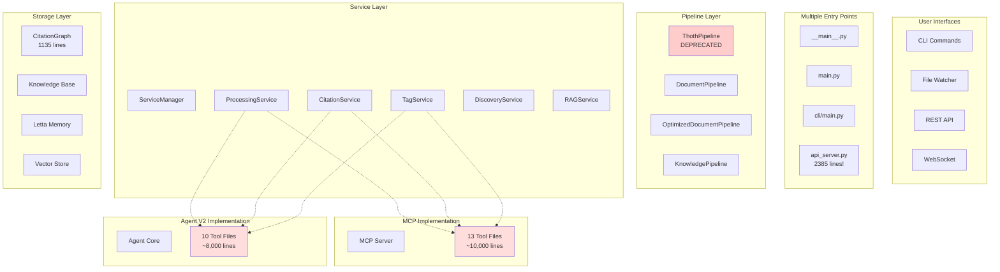
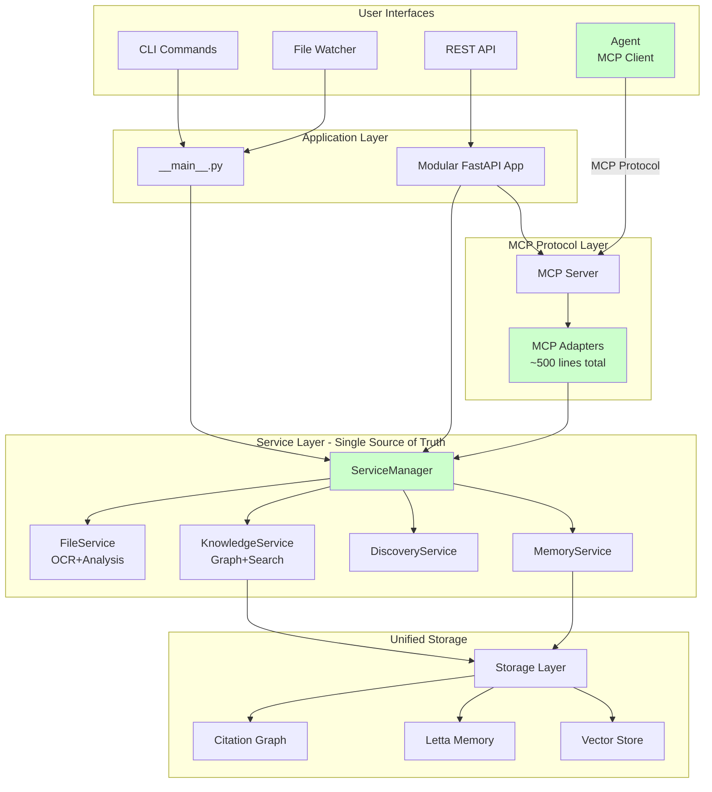

# Thoth Codebase Review Report

## Overview
This report provides a comprehensive analysis of the Thoth codebase, identifying areas of:
- Over-engineering
- Code duplication
- Opportunities for streamlining
- Maintenance improvements
- Refactoring recommendations

## Review Methodology
- Systematic review of every source code file in src/thoth/
- Analysis of design patterns and architectural decisions
- Identification of duplicate functionality
- Assessment of code complexity and maintainability

## Current Architecture Analysis

### The Core Problem: Triple Implementation

The codebase currently has THREE separate implementations of the same functionality:

1. **Services Layer** (`/services/`) - The core business logic
2. **MCP Tools** (`/mcp/tools/`) - Reimplements service functionality for MCP protocol
3. **Agent Tools** (`/ingestion/agent_v2/tools/`) - Reimplements service functionality again for the agent

This pattern repeats across all major features:
- Discovery: `DiscoveryService` → `discovery_tools.py` (MCP) → `discovery_tools.py` (Agent)
- Processing: `ProcessingService` → `processing_tools.py` (MCP) → `pdf_tools.py` (Agent)
- Citations: `CitationService` → `citation_tools.py` (MCP) → `analysis_tools.py` (Agent)
- And so on...

### Current Architecture Diagram



### Key Issues Identified

1. **Code Duplication**: ~18,000 lines of duplicate tool implementations
2. **Configuration Complexity**: 20+ configuration classes
3. **File Size Problems**: Multiple files over 1,000 lines
4. **Architectural Layers**: 4-5 layers of abstraction with minimal value
5. **Inconsistent Patterns**: Different modules follow different approaches

## Recommended Architecture: MCP as Universal Protocol

### The Solution: Single Implementation + MCP Protocol

Instead of three implementations, we will have:
1. **Services** - Single source of truth for all business logic
2. **MCP Adapters** - Thin wrappers exposing services via MCP protocol
3. **Agent as MCP Client** - Agent uses MCP protocol to access all tools

### Proposed Architecture Diagram



## Implementation Plan

### Phase 1: Create MCP Adapters (Week 1)

```python
# Example: services/mcp_adapters.py
class ServiceMCPAdapter:
    def __init__(self, service_manager: ServiceManager):
        self.services = service_manager
    
    def get_tool_definitions(self):
        return [
            {
                "name": "create_discovery_job",
                "description": "Create a new discovery job",
                "input_schema": {...},
                "handler": lambda args: self.services.discovery.create_job(**args)
            },
            # ... adapter for each service method
        ]
```

### Phase 2: Convert Agent to MCP Client (Week 2)

```python
# agent/core.py
class Agent:
    def __init__(self, mcp_server_url: str):
        self.mcp_client = MCPClient(mcp_server_url)
        self.tools = self.mcp_client.list_tools()
    
    async def execute_tool(self, tool_name: str, params: dict):
        return await self.mcp_client.call_tool(tool_name, params)
```

### Phase 3: Remove Duplicates (Week 3-4)

1. Delete `/mcp/tools/` directory (except adapter code)
2. Delete `/ingestion/agent_v2/tools/` directory completely
3. Update imports and tests
4. Consolidate configuration classes

### Phase 4: Simplify Architecture (Week 5-6)

1. Merge pipeline classes into one configurable pipeline
2. Consolidate entry points (remove main.py)
3. Break up large files (api_server.py → multiple modules)
4. Convert CitationGraph to a service

## Critical Requirements Preserved

✅ **File Watch Pipeline**: Maintained through FileService
✅ **Discovery System**: All sources available through DiscoveryService
✅ **Tool Availability**: All tools available via MCP to any client
✅ **Memory Management**: Letta and Knowledge Base unchanged
✅ **Deployment**: Simplified configuration for local/distributed setup

## Expected Outcomes

### Code Reduction
- **Before**: ~30,000 lines across duplicate implementations
- **After**: ~15,000 lines (50% reduction)
- **Removed**: 18,000 lines of duplicate tools, 2,000 lines of configuration

### Architectural Improvements
- **Single Source of Truth**: All business logic in services
- **Universal Protocol**: MCP for all tool access
- **Cleaner Separation**: Each component has one clear responsibility
- **Better Testing**: Test services once, works everywhere

### Maintenance Benefits
- Fix bugs in one place
- Add features in one place
- Clear ownership and responsibilities
- Easier onboarding for new developers

## Summary

The refactoring strategy is straightforward:
1. Keep services as the single implementation
2. Expose all services through MCP protocol
3. Make the agent an MCP client
4. Delete all duplicate implementations

This approach maintains 100% of functionality while reducing code by 50% and dramatically simplifying the architecture.